# AI 小说创作工作台 / AI Novel Production Engine
一个面向长篇小说创作的 AI Native 开源项目。

当前开发主线：
`Creative Hub + 自动导演开书 + 本书世界上下文 + 整本生产主链 + 写法引擎`


## ✨ 项目简介

这是一个**面向长篇小说完成度的 AI 生产系统**，不是普通的"你写一句、AI 补一句"聊天壳子。

它的核心做法是：

- 👉 用一句灵感启动整本书的规划，AI 自动给出方向 / 世界 / 角色 / 卷战略 / 章节任务
- 👉 把章节生成、审核、修复、状态回灌串成可暂停可恢复的生产链
- 👉 把拆书、知识库、写法引擎、角色资源账本、世界手册都做成可召回的长期资产
- 👉 提供漫画、短剧等衍生工坊围绕已完成的小说内容做视觉与剧本延展
- 👉 配套公开介绍站、生产链深度文档和按阶段的恢复手册

适合**完全不懂写作的新手**走完一本长篇，也适合研究 AI Native 应用、Agent Workflow、LangGraph 编排和长链路任务的开发者参考。

## Windows 桌面版

如果你只是想直接下载安装并开始使用，优先从桌面版入口进入：

- 下载入口：[GitHub Releases](https://github.com/winnerineast/GeneralAgent/releases)
- 最新版本页：[Latest Release](https://github.com/winnerineast/GeneralAgent/releases/latest)
- 建议优先下载 `Setup.exe` 安装版；如果你不想安装，或者想放在 U 盘 / 临时目录里直接运行，再选择 `portable` 版本
- 公开介绍站：[GitHub Pages 介绍站](https://winnerineast.github.io/GeneralAgent/) 提供功能预览、模块文档和使用指南

## 项目定位

很多 AI 写作工具的使用方式其实差不多：你输入一句 Prompt，它回你一段正文，不满意就重试。写短篇还行，写长篇容易越写越散。

这个仓库是"AI 导演式长篇小说生产系统"，核心产品判断是：

- 目标用户优先是完全不懂写作的新手，而不是熟悉结构设计的资深作者
- 优先解决"如何把整本书写完"，再逐步优化"写得多精巧"
- AI 不只是补全文本的模型，而是参与规划、判断、调度、执行和追踪的系统角色

如果你在找下面这类项目，这个仓库会更值得关注：

- 想验证 AI 是否真的能参与整本小说生产，而不是只写单段文案
- 想研究 AI Native Product、Agent Workflow、LangGraph 编排怎样落到真实创作业务
- 想把世界观、角色、拆书、知识库、写法控制、章节生成、质量修复串成一套稳定工作流

## 现在已经能做什么

### 1. AI 自动导演开书与四种运行模式

- 从一句灵感直接进入自动导演，无需先手写世界观、主线、角色和卷纲；系统先整理项目设定、对齐书级 framing，再生成多套整本方向和对应标题组
- 方向不满意时可以继续生成、定向修订某一套方案、或只重做某套方案的标题组，避免"满意就确认 / 不满意就整批重来"
- 自动导演提供四种运行模式：**先准备到可开写**（推荐第一本书）、**全书自动成书**、**按范围执行**（全书 / 前 N 章 / 第 1 卷）、**正文后去 AI 检测与修正**（叠加质量闭环）
- 全自动驾驶模式下遇到模型不可用、配额耗尽、连续修复失败、要求重新规划等情况会主动停下，而不是无限重试；所有状态保存到导演跟进，可从原检查点恢复
- 全自动模式下每批章节完成后自动确认 pending 候选角色，角色进入正式名册并触发动态重建，消除后续章节角色一致性漂移
- 链路覆盖书级方向、故事宏观规划、本书世界、角色准备、卷战略 / 卷骨架、节奏板、章节清单、章节细化、章节执行、审核、修复，每一阶段都支持检查点恢复、接管和换模型重试

### 2. Creative Hub 与 Agent Runtime

- 统一创作中枢承载对话、追问、规划、工具调用、任务状态和回合总结，不再是分散的功能按钮
- 系统内有明确的 Planner、Tool Registry、Runtime、审批节点、状态卡片和中断恢复链路；自然语言意图会被路由到对应的自动导演阶段或章节任务
- 浏览器暂停通知：到达 checkpoint 时弹出系统通知，长链路任务挂机更安心

### 3. 整本生产主链与章节执行

- 单章运行时、章节执行和整本批量 pipeline 收敛到同一条主链
- 章节生成上下文按本章参与者精准筛选角色资源账本，避免把全部角色塞进 prompt；高风险已入账与待确认提案分别走不同审计代码，正文不会把待确认资源写成既成事实
- 章节执行链覆盖正文生成、AI 审核、可修复问题处理、质量债务记录、角色状态 / 事实 / 伏笔回灌、下一章入口
- LLM 限速器修复内存泄漏：provider 配置变更时淘汰旧限速器，长期运行内存稳定

### 4. 拆书工作台与角色形象演变

- 拆书角色档案分**简要 / 标准 / 深入 / 完整**四档，深入和完整档案会回溯原文片段补全维度
- **角色形象演变**：按 25% / 50% / 75% / 100% 覆盖率增量扫描出场章节，沉淀每章外貌、服装、状态和场景锚点，并基于章节快照生成同一角色阶段形象图；提取的短外貌词条放入待确认区，勾选后融合到角色档案
- 章节形象图可引用角色基础形象图，保持脸型 / 发型 / 标志细节一致
- 拆书还提供双栏阅读、章节证据回溯、范围定向分析、token 预算守卫、稿件诊断模式

### 5. 写法引擎与反 AI 规则

- 写法不再只是提示词里的一段说明，而是可保存、编辑、绑定、试写、复用的长期资产
- 可从现有文本提取写法特征 + 原文样本；特征沉淀为可见特征池，逐项启用 / 停用 / 组合，规则同步重编译
- 写法引擎参与生成、检测和修正链路；反 AI 规则减少正文模板感、解释感和空泛表达

### 6. 本书世界、角色、知识库联动 + RAG

- 世界观从大段设定文本升级为可生成 / 复用 / 同步的本书世界；地图、势力图谱会进入章节上下文
- 拆书结果和知识库文档通过 RAG 回灌到规划、续写和正文生成
- RAG 索引流式并行：Embedding 与 Qdrant 写入并发可调；拆书产物入 facets 索引让召回包含拆书结论；chunk hash 去重防止重建产生重复向量；retrieval trace 后端可追踪召回为什么命中

### 7. 漫画与短剧衍生工坊

- **漫画工作台**：场景一致性、角色视觉资产、视觉锚点控制；分镜与角色面板支持图像生成确认弹窗，避免误触消耗额度。支持**小说改编漫画**：在小说编辑页提供“改编漫画”快捷按钮，自动提取小说的世界设定（势力、法则、地标）并作为一致性背景设定传入分镜 LLM，一键路由并自动预填漫画工作台的创建向导。
- **短剧改编生产管线 (VellumReel)**：全新深度集成 `vellum-reel` 本地视频/短剧渲染引擎，支持通过小说分镜剧本一键合成生成 9:16 竖版视频。
  - **完全离线渲染支持**：集成 6 幅高清晰手绘国风山水水墨插图作为 Stable Diffusion 离线时的兜底插画，确保在纯本地模式下渲染出优美、富有古典韵味的国风画面。
  - **本地高保真 TTS 语音合成**：自带基于 Kokoro-ONNX v1.0 多语言模型的本地 FastAPI 语音服务器，利用 `misaki[zh]` 库实现完全离线、流畅、无英文口音的高质量中文/英文配音。
  - **通用音视频对齐与指令清洗**：自动识别剧本角色性别属性进行配音音色映射（`am_`/`bm_` -> 顺畅中文男音 `zm_yunjian`，`af_`/`bf_` -> 顺畅中文女音 `zf_xiaoxiao`），并通过通用正则表达式对配音文本中夹带的舞台调度信息及角色名（如 `宝玉：`、`（吸气）` 等）进行净化过滤，保证最终视频旁白干净自然。
- 衍生工坊不在主链跑通前打开——它们消费的是小说已生成的章节、角色和场景

### 8. 公开介绍站与文档体系

- GitHub Pages **公开介绍站**（端口 4173）展示主链、产品截图、文档入口与下载链接
- 文档站提供本地全文搜索、面包屑、文内目录、上 / 下一篇导航、tip / warn / checkpoint 提示块、GFM 表格
- 33 篇公开文档：项目介绍、安装与准备、常见问题、故障排查、第一本小说实操路径、按阶段恢复手册、端到端生产链、自动导演阶段全景、章节执行链、知识与 RAG 召回链 + 模块说明
- 模块文档配套真实产品截图；自动导演阶段名用中文表达，技术别名对照表保留在自动导演阶段全景文末供开发者查阅

### 9. 模型路由与本地运行

- 支持 OpenAI、DeepSeek、SiliconFlow、xAI 等多提供商；规划、正文、审阅、拆书等链路可按任务拆开路由
- 默认 SQLite 即可跑通主链；需要 RAG 检索时再接入 Qdrant
- RAG 并发数、限速等运行时参数从 .env 迁到设置面板，改完即生效无需重启
- Monorepo 拆分（pnpm workspace），桌面版 / 介绍站 / 服务端 / 客户端独立可构建


## 典型使用路径

1. 在小说创建页输入一句灵感，先让 AI 自动导演给出整本方向候选。
2. 进入 `项目设定`，先把题材、卖点、目标读者感受和前 30 章承诺定下来。
3. 用 `故事宏观规划`、`本书世界` 和 `角色准备`，把整本主线、舞台边界和角色网补到能写。
4. 进入 `卷战略 / 卷骨架` 决定怎么分卷，再到 `节奏 / 拆章` 把当前卷落到章节列表和单章细化。
5. 按需绑定拆书结果、知识库文档和写法资产，让后续正文不只是靠一次性提示词。
6. 进入 `章节执行` 逐章写作、审计、修复，必要时回到卷工作台做再平衡和重规划。
7. 想加速推进时，再启动整本生产任务，持续查看状态、失败原因和回灌结果。

## 当前长篇生成能力支撑图


- 开书定盘负责先把这本书“要写成什么样”说清楚，避免后面越写越散。
- 整本控制层和卷级规划层负责把长篇拆成可推进、可回看、可调整的结构，而不是一次性写死。
- 角色、世界观、写法、知识库和质量控制一起托住单章生成，让每一章都尽量还在同一本书里。
- 每写完一章，系统都会把新状态回灌回去，继续影响后续章节、卷级节奏和必要时的重规划。

## 最新更新

完整历史更新见 [docs/releases/release-notes.md](./docs/releases/release-notes.md)。

### 2026-07-15（世界沙盒物理生态仿真控制台与平行宇宙分支）

本阶段开发任务全部完成，包括地缘物理生态（海拔直减、动植物种群消长）、人物 Agent 艾宾浩斯记忆与 LOD 决策、戏剧张力与 Encounter Box 碰撞检测拦截、Git-like 零拷贝平行宇宙分支时序剪枝、虚拟摄像机光电渗漏过滤 feed 与正文 Paradox 校验，以及网页端 SVG 动态电子沙盘实时控制面板（VCR 播放器与自定义属性添加）等功能落地。

> 查看完整更新历史：[docs/releases/release-notes.md](./docs/releases/release-notes.md)

### 2026-06-07

知识库体验大幅提升，支持一键批量上传和更清晰的运行状态展示：

- 知识库现在支持一键选择多个文件进行批量上传，并在界面清晰展示每一个文件的上传、跳过或失败状态。
- 新增上传查重保护：在批量上传时会自动比对同名文件的内容，跳过内容完全一致的重复上传操作，防止产生无效的文档新版本。
- 修复了读取大量本地文本文件时因为编码猜测打分导致的浏览器卡死问题。现在会优先识别标准 UTF-8 和 BOM 头，且编码检测时间缩短到 1 毫秒内。
- 运行状态页面的“最近任务”列表优化：现在会直接显示人类可读的知识库文档标题，而不是难以辨认的数据库乱码 ID。

## 功能预览
### 功能概览中的95%以上编写都是AI完成

下面这组截图优先展示当前版本正在使用的单书工作流：从自动导演开书，到项目设定、故事宏观规划、角色准备、卷战略、节奏拆章、章节执行，再到质量修复，已经开始收成一条连续推进链，而不是一组彼此割裂的演示页。

### 提示词编辑器

提示词编辑器用于调试和维护产品级 AI 任务的提示词资产。正文生成提示词支持本书范围的高级模板编辑，可以用可视化引用标签插入书级合约、章节任务、角色事实、时间线、运行变量和槽位规则，并通过预览检查最终 messages 与上下文注入结果。


### Creative Hub

统一承载对话、规划、工具执行和创作推进的创作中枢。

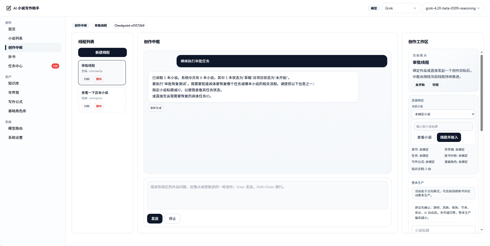

### 自动导演模式

自动导演创建页现在会把一句灵感、导演起始参数、书级 framing、模型设置和运行方式收进同一面板；进入方向选择后，不只是给你两套整本方案，还会配套书名组选项、推荐理由和定向重做入口，适合先把这本书“该怎么开”定下来。


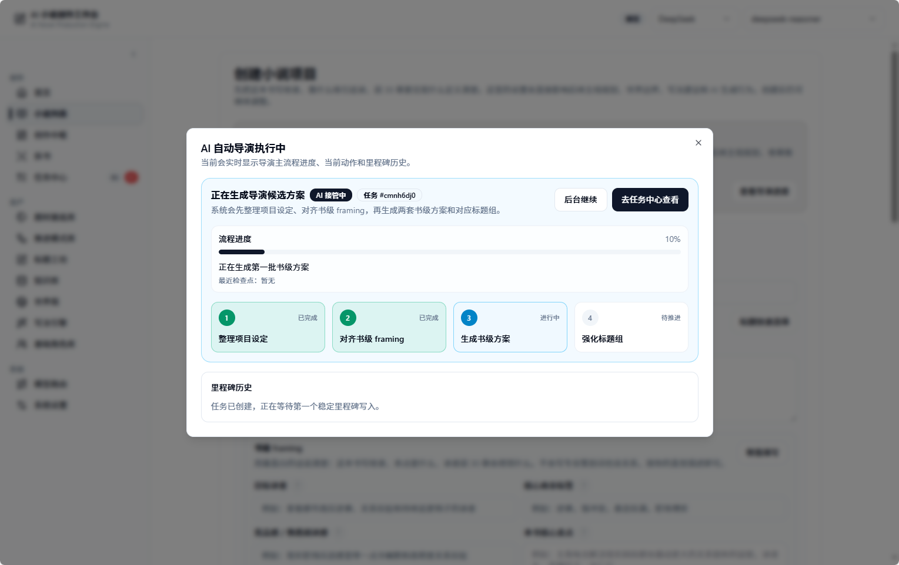

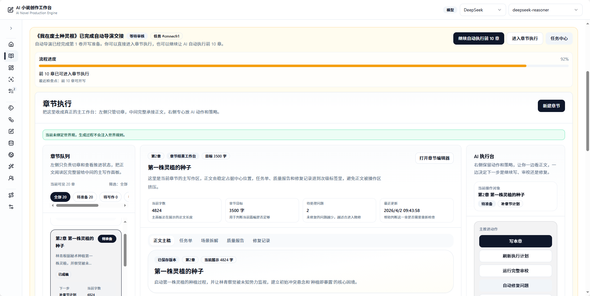

### 项目设定

项目设定已经挂到单书工作台的连续流程里：左侧能直接看到当前步骤与整体进度，上方能看到 AI 接管状态，正文区则集中处理标题、简介、书级 framing、写法确认和本书真正会用到的世界边界。

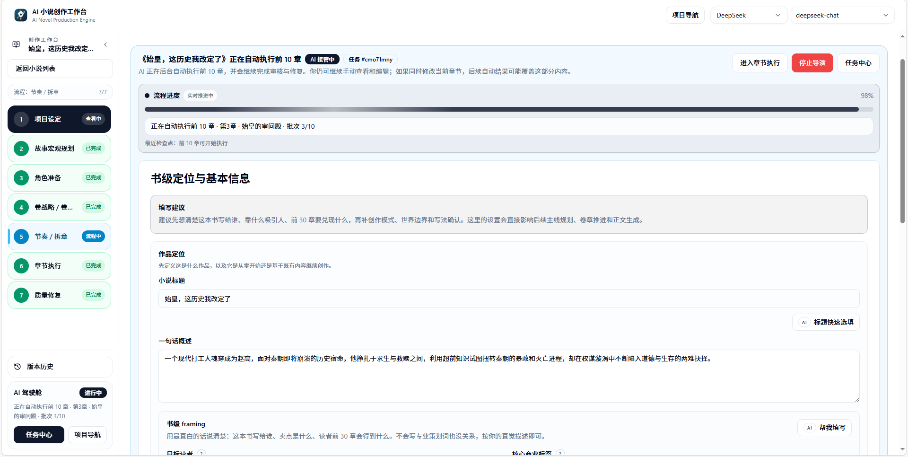

### 故事宏观规划

故事宏观规划不再只是大段摘要，而是先把故事引擎、推进与兑现摘要、长期对立和前 30 章承诺压成后续可继承的书级引导层，先保证整本主线能推，再把卷级和章节级规划建在这套底盘上。

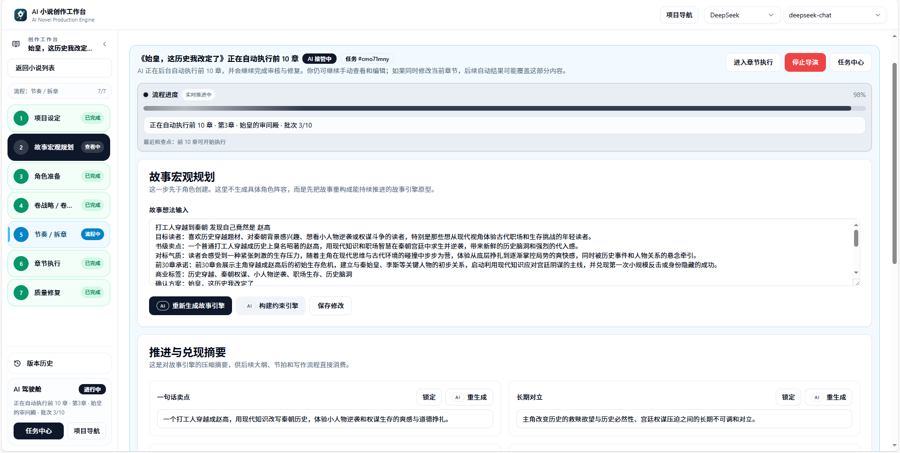

### 角色准备

角色准备页现在更像角色工作台而不是角色表单：会先盘点目标区段的核心角色，再给出 AI 阵容方案、结构关系网和动态角色系统，减少开书后角色断档、功能位缺失和关系推进失速。

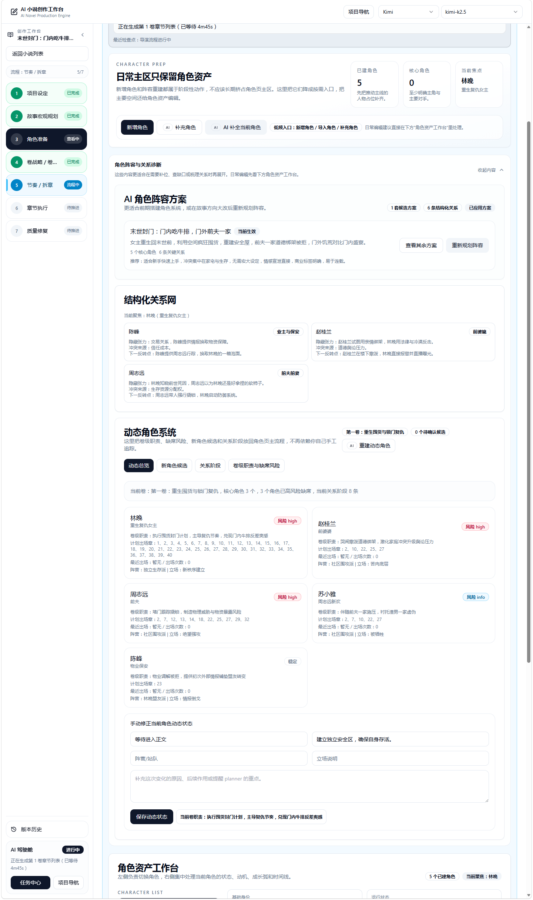

### 卷战略 / 卷骨架

卷战略阶段已经开始显式区分“卷战略、卷骨架、节奏板、拆章节”四个阶段完成度。系统会先判断当前是不是已经具备继续推进条件，再生成卷战略建议、审查卷骨架，并把版本控制与影响分析收进同一页。

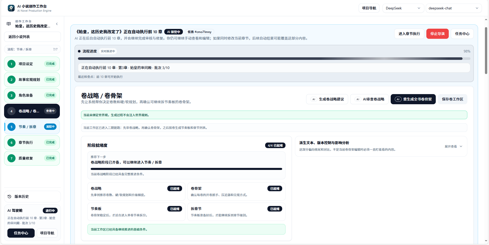

### 节奏 / 拆章

节奏 / 拆章现在把节奏段列表、批量细化、单章标题、摘要、章节目标和任务单放进同一工作区；可以按当前可见章节或指定范围连续细化，也可以对摘要和目标做局部 AI 修正，更适合连载网文式的持续推进。

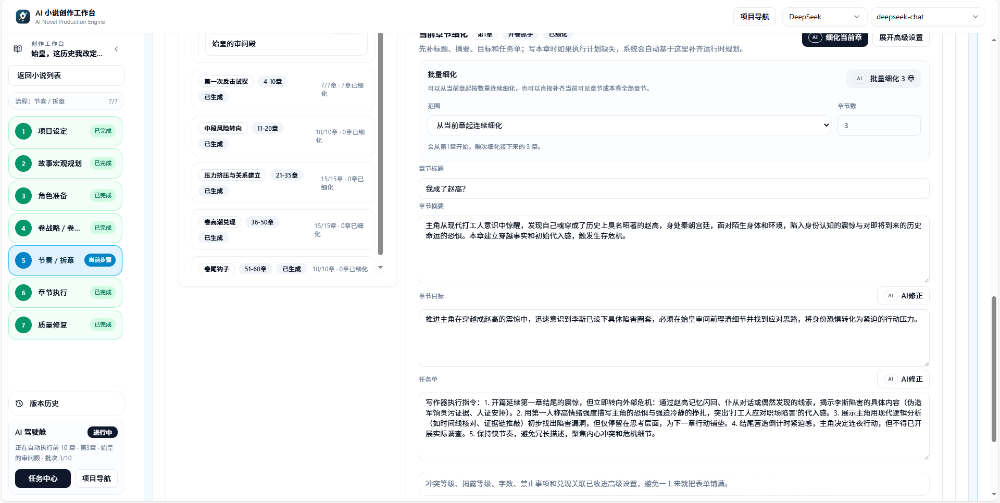

### 章节执行

章节执行页现在更像主写作工作台：左侧是章节卡片与下一步状态，中间是已保存正文和版本区，右侧则把执行计划、正文写作、审核、修复、状态同步和伏笔回填收在同一套动作面板里，适合逐章推进。

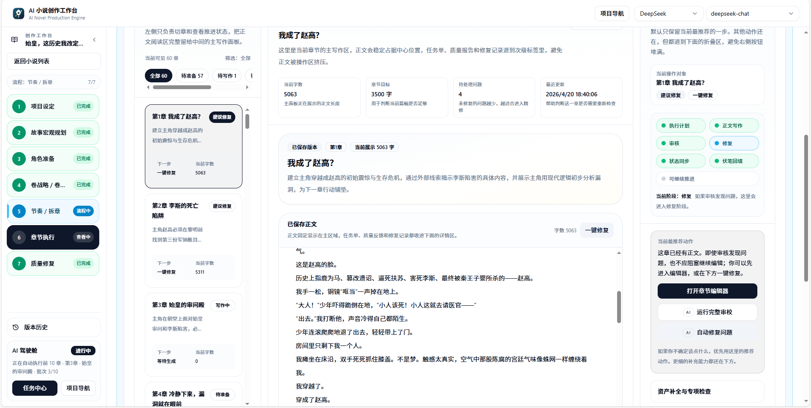

### 质量修复

质量修复已经从零散按钮收成独立工作台：可以围绕当前章节执行审核、执行修复、生成钩子，并结合当前批次、质量阈值和 AI 输出继续往后处理，适合把“写完之后怎么稳住质量”也纳入主流程。

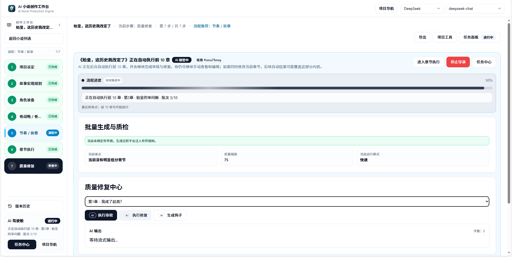

### 正文修改

当一章已经写出正文后，还可以进入独立正文编辑器继续局部改写。正文修改页会把任务单、审计结果和修复链路继续挂在这章身上，避免用户在“主写作区”和“精修区”之间断掉上下文。

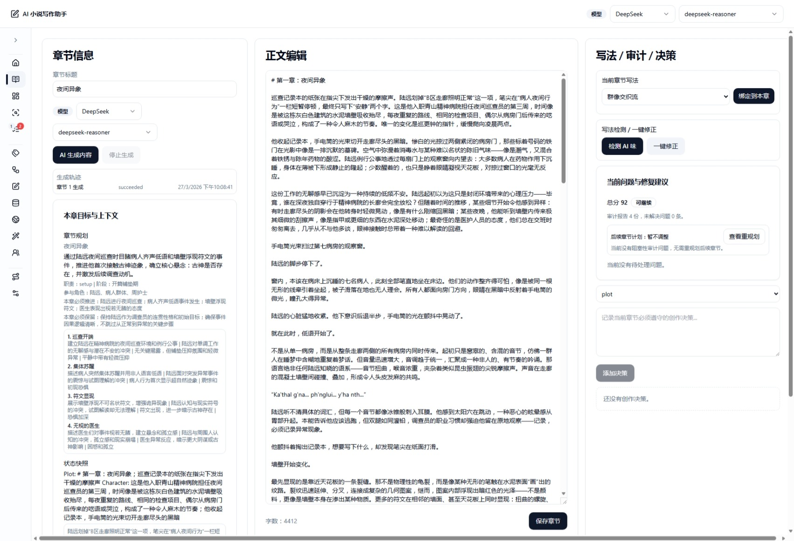

### 小说列表

从这里进入开书、管理、编辑和整本生产。

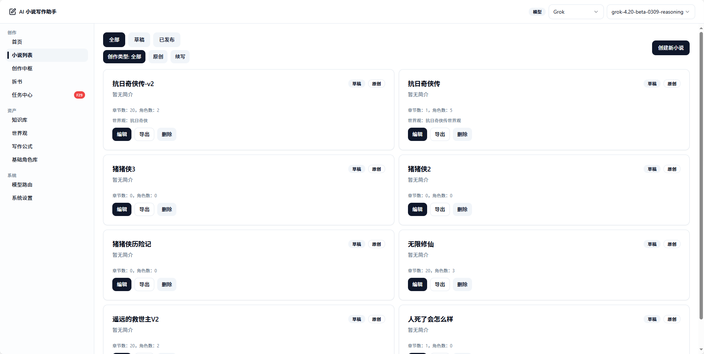

### 拆书分析

拆书分析已经不只是生成一篇读后感：可选快速 / 标准 / 完整三档拆书，覆盖题材定位、剧情结构、人物系统、世界设定和写法技法；角色档案支持简要 / 标准 / 深入 / 完整四档深度，还能按 25% / 50% / 75% / 100% 覆盖率对角色做形象演变的增量扫描，生成跨章节一致的参考图。拆书结论可以直接发布到知识库、一键转成写法资产，或把角色升格进基础角色库，让“拆一本书”变成后续创作能反复调用的长期资产，而不是看完就忘的一次性笔记。

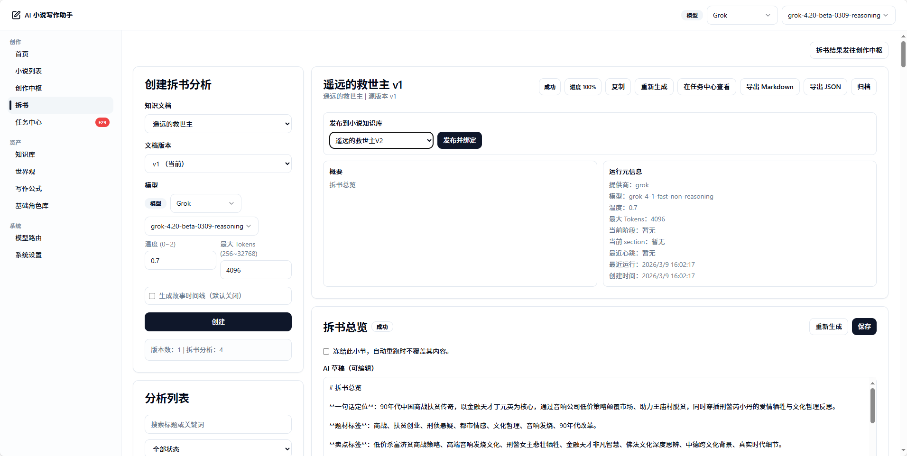

### 知识库

统一管理文档、索引、重建任务和检索能力。


### 世界观

世界观不再只是描述文本，而是能生成世界骨架、维护世界手册，并绑定为每本小说自己的本书世界上下文。

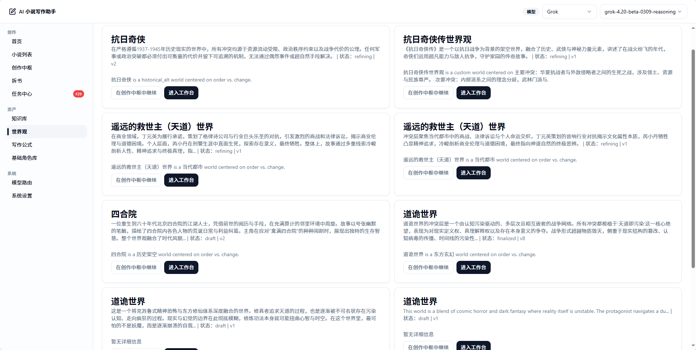

### 角色库

统一维护角色基础档案与小说内角色信息。


### 类型管理

集中维护题材与类型资产，让故事规划、角色准备和正文生成共享同一套题材语言。

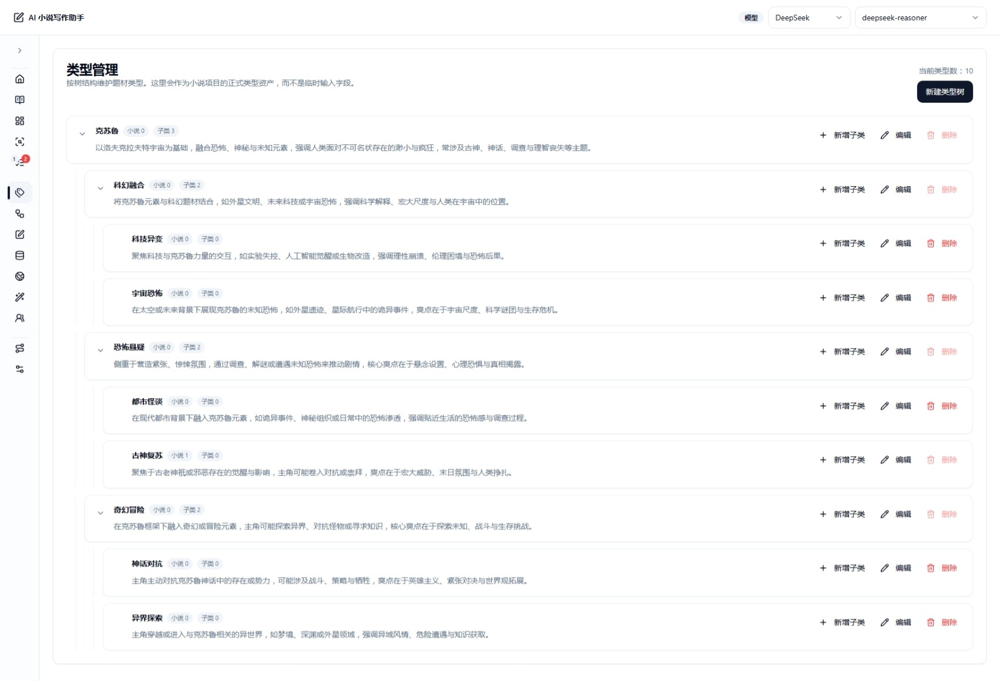

### 流派管理

把推进模式、兑现方式和冲突边界收成可复用的流派模式资产，让整本书更容易保持读者预期。

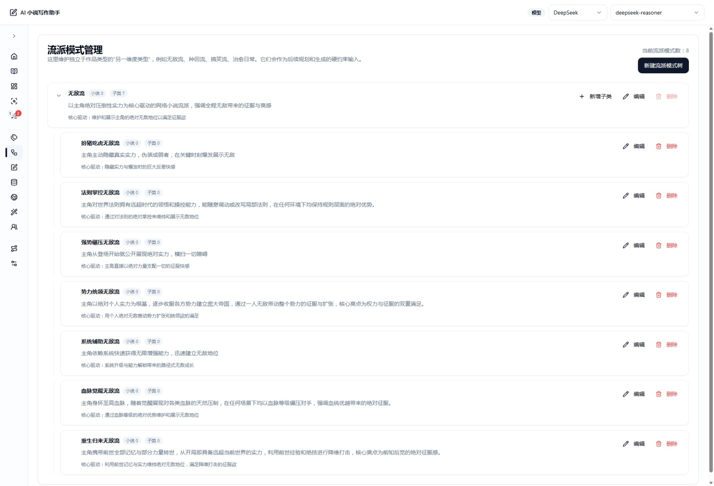

### 标题工坊

批量生成、筛选和微调书名与标题方向，降低新手在开书命名阶段的试错成本。


### 写法引擎与反 AI 规则

统一管理写法资产、风格约束和反 AI 规则，让正文更像作品本身，而不是模板式补全文本。


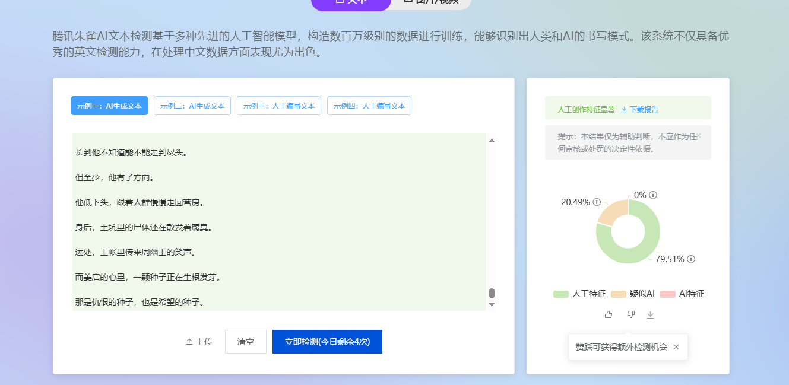

### 任务中心

查看拆书、知识库重建和其他后台任务的排队、执行与失败状态。


### 模型配置

为不同能力配置不同模型，减少一套模型硬吃所有任务的成本。

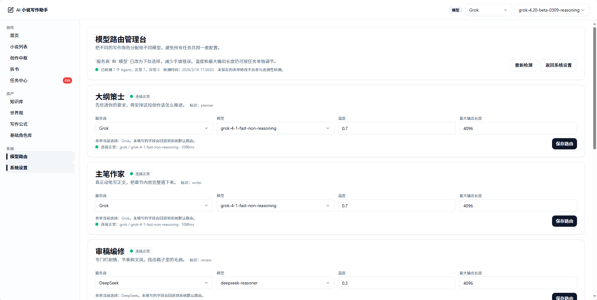

## 快速开始

### 环境要求

- Node.js `^20.19.0 || ^22.12.0 || >=24.0.0`
  推荐直接使用 `20.19.x LTS`
- pnpm `>= 10.6`
  推荐直接使用仓库声明的 `pnpm@10.6.0`
- 至少一组可用的 LLM API Key
  也可以先把项目跑起来，再在页面里配置
- 如果你要完整体验知识库 / RAG，再额外准备可用的 Qdrant

### 1. 安装依赖

```bash
pnpm install
```

默认的 `pnpm install` 现在只准备 Web / Server 开发所需依赖，不会在首次安装时强制下载 Electron 桌面运行时。

- 如果你只是运行现有 Web / Server 开发流，到这里就够了
- 如果你要启动桌面端开发壳，首次运行 `pnpm dev:desktop` 时会自动补拉 Electron 运行时
- 如果你想提前完成这一步，也可以手动执行：

```bash
pnpm run prepare:desktop-runtime
```

桌面端运行时首次下载需要可访问 Electron 分发源的网络环境；如果你所在网络无法访问 GitHub Releases，建议先配置代理或镜像后再执行桌面端命令。

如果你在 Windows 上执行 `pnpm install` 时卡在 `prisma preinstall`，通常先检查这两类问题：

1. Node 版本过低
   Prisma 7 目前要求 Node `^20.19.0 || ^22.12.0 || >=24.0.0`。如果你还在 `20.0 ~ 20.18`，建议先升级到 `20.19.x LTS` 再安装。
2. `script-shell` 被配置成了交互式 shell
   如果全局 `npm/pnpm script-shell` 被设成了 `cmd.exe /k` 之类会保留提示符的形式，Prisma 的 lifecycle script 可能不会自动退出，看起来就像安装“卡死”在：
   `node_modules/.../prisma>`

可以先运行下面几条命令自查：

```bash
node -v
pnpm config get script-shell
npm config get script-shell
```

如果 `script-shell` 返回的是带 `/k` 的 `cmd.exe`，建议删除这项配置后重新打开终端：

```bash
npm config delete script-shell
pnpm config delete script-shell
```

然后重新执行：

```bash
pnpm install
```

### 2. 配置环境变量

这个仓库通过 pnpm workspace 分别启动前后端，所以环境变量也是按子包读取的：

- 服务端运行在 `server/` 工作目录，默认读取 `server/.env`
- 前端运行在 `client/` 工作目录，默认读取 `client/.env` / `client/.env.local`
- 根目录 `.env.example` 目前更适合当“总览参考”，不是 `pnpm dev` 默认读取的主入口

#### 2.1 服务端环境变量

先复制服务端示例文件：

```bash
# macOS / Linux
cp server/.env.example server/.env

# Windows PowerShell
Copy-Item server/.env.example server/.env
```

最少建议先确认这些项目：

- `DATABASE_URL`
  默认就是本地 SQLite，可直接使用
- `RAG_ENABLED`
  如果你暂时不接知识库，建议先设为 `false`
- `QDRANT_URL`、`QDRANT_API_KEY`
  只有要启用 Qdrant / RAG 时才需要

注意：

- `OPENAI_API_KEY`、`DEEPSEEK_API_KEY`、`SILICONFLOW_API_KEY` 这类变量可以先留空
- 项目启动后，也可以在页面中配置模型供应商和默认模型

#### 2.2 前端环境变量

大多数本地开发场景，其实不需要单独创建前端 env。

因为前端开发模式下默认会把 API 指到：

```text
http(s)://当前页面 hostname:3000/api
```

这也包括“同一台机器启动服务，然后用局域网 IP 在别的设备上访问”的场景。
例如页面开在 `http://192.168.0.37:5173`，前端默认会自动把 API 指到：

```text
http://192.168.0.37:3000/api
```

只有在这些场景下，才建议创建 `client/.env`：

- 前端和后端不在同一台机器
- 你想把前端显式指向别的 API 地址
- 你需要固定 `VITE_API_BASE_URL`

如果你已经复制了 `client/.env.example`，又发现浏览器请求都跑到了 `http://localhost:3000/api`，通常就是因为你把 API 显式固定死了。对同机 / 局域网访问，建议直接删除或注释掉 `VITE_API_BASE_URL`。

示例：

```bash
# macOS / Linux
cp client/.env.example client/.env

# Windows PowerShell
Copy-Item client/.env.example client/.env
```

内容通常只需要：

```env
# 同机 / 局域网访问时，通常不需要这一行
# VITE_API_BASE_URL=http://localhost:3000/api
```

#### 2.3 模型供应商并不一定要写死在 env

当前项目已经支持在页面里配置模型相关设置：

- `/settings`
  配置供应商 API Key、默认模型、连通性测试
- `/settings/model-routes`
  给不同任务分配不同 provider / model
- `/knowledge?tab=settings`
  配置 Embedding provider、Embedding model、集合命名和自动重建策略

所以环境变量里的 `OPENAI_MODEL`、`DEEPSEEK_MODEL`、`EMBEDDING_MODEL` 等，更适合当作：

- 启动默认值
- 数据库里还没保存设置时的回退值

### 3. Starting Development Environment / 启动开发环境

#### Option A: One-Click Startup (All Services) / 一键启动
```bash
pnpm dev
```
If you have copied `server/.env` and `client/.env`, this is the default one-click command to run all services concurrently.

#### Option B: Separate Startup (Recommended for macOS Debugging) / 分步单独启动
To monitor backend logs and frontend console separately on macOS, open three separate terminal windows/tabs:

1. **Terminal 1: Shared Package Compiler**
   ```bash
   pnpm dev:shared
   ```
   This watches and compiles the `@ai-novel/shared` package.

2. **Terminal 2: Backend Server**
   ```bash
   pnpm dev:server
   ```
   This starts the backend Express server on `http://localhost:3000` (which automatically generates the Prisma client and pushes migrations on first startup).

3. **Terminal 3: Frontend Client**
   ```bash
   pnpm dev:client
   ```
   This starts the Vite React application on `http://localhost:5173`.

#### Option C: Background Service Management Script (macOS Utility) / 使用后台管理脚本
We have provided a helper script at [scripts/manage.sh](file:///Users/nvidia/GeneralAgent/scripts/manage.sh) to start, stop, restart, or check the status of the development services in the background:

- **Start all services in background**:
  ```bash
  ./scripts/manage.sh start
  ```
- **Stop all services**:
  ```bash
  ./scripts/manage.sh stop
  ```
- **Check service status**:
  ```bash
  ./scripts/manage.sh status
  ```
- **Restart all services**:
  ```bash
  ./scripts/manage.sh restart
  ```

Default URLs:


- Frontend Client: `http://localhost:5173`
- Backend API: `http://localhost:3000`
- API Endpoint: `http://localhost:3000/api`


首次启动服务端时，会自动执行 Prisma generate 和 `db push`。
只有在你自己修改了 Prisma schema，或者要处理正式迁移流程时，才需要手动使用 Prisma / 数据库相关命令。

建议第一次启动后先做这几步：

1. 打开 `http://localhost:5173/settings`，至少配置一组可用的模型供应商 API Key
2. 打开 `http://localhost:5173/settings/model-routes`，检查各任务实际使用的模型路由
3. 如果要启用知识库，打开 `http://localhost:5173/knowledge?tab=settings`，保存 Embedding / Collection 设置

### 4. 如果你使用 Qdrant Cloud

如果你只是先体验主流程，其实可以先跳过 Qdrant，直接在 `server/.env` 里设：

```env
RAG_ENABLED=false
```

如果你要启用 Qdrant Cloud，可以按下面的最小流程来：

1. 到 [Qdrant Cloud](https://cloud.qdrant.io/) 注册账号。
2. 在 `Clusters` 页面创建一个集群。
   测试阶段用 Free cluster 就够了。
3. 集群创建完成后，到集群详情页复制 Cluster URL。
4. 在集群详情页的 `API Keys` 中创建并复制一个 Database API Key。
   这个 key 创建后通常只展示一次，建议立即保存。
5. 把它们写入 `server/.env`：

```env
QDRANT_URL=https://your-cluster.region.cloud.qdrant.io:6333
QDRANT_API_KEY=your_database_api_key
```

6. 启动项目后，再去 `知识库 -> 向量设置` 页面选择 Embedding provider / model，并保存集合设置。

对这个项目来说，`QDRANT_URL` 建议直接填 REST 地址，也就是带 `:6333` 的地址。

如果你想手动验证连通性，可以用：

```bash
curl -X GET "https://your-cluster.region.cloud.qdrant.io:6333" \
  --header "api-key: your_database_api_key"
```

你也可以把集群地址后面拼上 `:6333/dashboard` 打开 Qdrant Web UI。

Qdrant 官方文档：

- [Create a Cluster](https://qdrant.tech/documentation/cloud/create-cluster/)
- [Database Authentication in Qdrant Managed Cloud](https://qdrant.tech/documentation/cloud/authentication/)
- [Cloud Quickstart](https://qdrant.tech/documentation/cloud/quickstart-cloud/)

### 5. 可选初始化

下面这些都不是首次启动 `pnpm dev` 的前置步骤：

```bash
pnpm db:seed
pnpm db:studio
```

## 常用命令

```bash
pnpm dev
pnpm build
pnpm typecheck
pnpm lint
# 仅在你开发/调整 Prisma schema 时再手动使用
pnpm db:migrate
pnpm db:seed
pnpm db:studio
pnpm --filter @ai-novel/server test
pnpm --filter @ai-novel/server test:routes
pnpm --filter @ai-novel/server test:book-analysis
```

## 技术栈与架构

### 技术栈

| 层级 | 技术 |
| --- | --- |
| 前端 | React 19 + Vite + React Router + TanStack Query + Plate (富文本编辑器) |
| 后端 | Express 5 + Prisma 7 + Zod |
| AI 编排 | LangChain + LangGraph |
| 数据库 | SQLite (主库) + Qdrant (向量库/RAG) |
| 工程形态 | pnpm workspace Monorepo (pnpm@10.6.0) |
| 桌面端 | Electron (electron-builder 打包) |
| Node 版本 | `^20.19.0 \|\| ^22.12.0 \|\| >=24.0.0` |

### Monorepo 结构

```text
GeneralAgent/
├── client/          # React + Vite 前端 (@ai-novel/client)
├── server/          # Express + Prisma + Agent Runtime (@ai-novel/server)
├── shared/          # 前后端共享类型与协议 (@ai-novel/shared)
├── desktop/         # Electron 桌面端壳 (@ai-novel/desktop)
├── docs/            # 设计文档 / wiki / 发版说明 / 历史归档
├── images/          # README 与产品截图
├── scripts/         # 启动和辅助脚本
├── infra/           # 基础设施配置 (Docker 等)
└── .github/         # CI/CD workflows
```

更细的文档分区说明可以看 [docs/README.md](./docs/README.md)。

完整的文件级项目结构审计见 [docs/sourcegraph/project-source-audit.md](./docs/sourcegraph/project-source-audit.md)，包含所有后端服务、前端页面、Prompt 体系、数据库模型、测试套件和文档体系的逐文件清单与规模统计。

---

### 服务端架构 (`server/src/`)

```text
server/src/
├── app.ts                 # Express 应用入口 & 路由挂载
├── agents/                # AI Agent (Editor Agent 等)
├── chains/                # LangChain chains
├── config/                # 服务端配置
├── creativeHub/           # Creative Hub 创作中枢 (LangGraph 编排)
│   ├── CreativeHubLangGraph.ts       # 主 LangGraph 图定义
│   ├── CreativeHubInterruptLangGraph.ts  # 中断恢复图
│   └── CreativeHubService.ts         # 服务层
├── db/                    # 数据库连接
├── events/                # 事件系统
├── graphs/                # LangGraph Agent 工作流图
│   ├── novelOutlineGraph.ts          # 小说大纲
│   ├── worldBuildingGraph.ts         # 世界观构建
│   ├── characterDesignGraph.ts       # 角色设计
│   └── writingFormulaGraph.ts        # 写法公式
├── llm/                   # LLM 集成层
│   ├── factory.ts                    # LLM 工厂
│   ├── modelRouter.ts                # 模型路由 (多任务/多模型)
│   ├── structuredInvoke.ts           # 结构化输出调用
│   ├── structuredOutput.ts           # 输出 Schema
│   ├── usageTracking.ts              # Token 用量追踪
│   └── reasoning.ts                  # 推理链
├── middleware/             # Express 中间件
├── modules/                # 功能模块
├── platform/               # 平台基础设施 (connectors 等)
├── prisma/                 # Prisma schema & 迁移
├── prompting/              # Prompt Registry 系统 ⭐
│   ├── registry.ts                   # Prompt 注册中心
│   ├── core/                         # Prompt 运行器/类型/预算
│   ├── prompts/                      # 按业务域分类的 Prompt 资产
│   │   ├── novel/                    # 小说相关 Prompt
│   │   ├── audit/                    # 审计 Prompt
│   │   ├── comic/                    # 漫画 Prompt
│   │   └── drama/                    # 短剧 Prompt
│   ├── slots/                        # Prompt 插槽覆盖系统
│   └── workflows/                    # Prompt 工作流
├── routes/                 # API 路由层 (~25 个路由文件)
├── runtime/                # 运行时基础设施
├── services/               # 业务服务层 ⭐ (核心)
│   ├── novel/              # 小说服务 (最大/最复杂)
│   │   ├── director/       # 自动导演 (AutoExecution/Recovery/Takeover)
│   │   ├── runtime/        # 章节运行时 (Pipeline/Artifact/Context)
│   │   ├── production/     # 整本生产
│   │   ├── planning/       # 规划层
│   │   ├── volume/         # 卷管理
│   │   ├── quality/        # 质量控制
│   │   ├── dynamics/       # 角色动态
│   │   ├── fact/           # 事实账本
│   │   ├── state/          # 状态管理
│   │   └── ...
│   ├── comic/              # 漫画服务
│   ├── drama/              # 短剧服务
│   ├── character/          # 角色服务
│   ├── world/              # 世界观服务
│   ├── knowledge/          # 知识库服务
│   ├── rag/                # RAG 检索增强
│   ├── styleEngine/        # 写法引擎
│   ├── bookAnalysis/       # 拆书分析
│   ├── audit/              # 审计服务
│   ├── image/              # 图像服务
│   └── ...
├── types/                  # 类型定义
└── workers/                # 后台 Worker
```

### 客户端架构 (`client/src/`)

```text
client/src/
├── main.tsx           # 入口
├── index.css          # 全局样式 (~22KB, 设计系统)
├── api/               # API 客户端
├── components/        # UI 组件库
├── hooks/             # 自定义 Hooks
├── lib/               # 工具库
├── pages/             # 页面 (按功能域组织)
│   ├── Home.tsx                   # 首页
│   ├── novels/                    # 小说相关页面
│   ├── creativeHub/               # Creative Hub
│   ├── characters/                # 角色管理
│   ├── worlds/                    # 世界观管理
│   ├── bookAnalysis/              # 拆书分析
│   ├── knowledge/                 # 知识库
│   ├── writingFormula/            # 写法引擎
│   ├── genres/                    # 流派管理
│   ├── settings/                  # 设置
│   ├── tasks/                     # 任务中心
│   └── ...
├── router/            # 路由配置
├── store/             # 状态管理
└── config/            # 客户端配置
```

---

### 核心业务流程

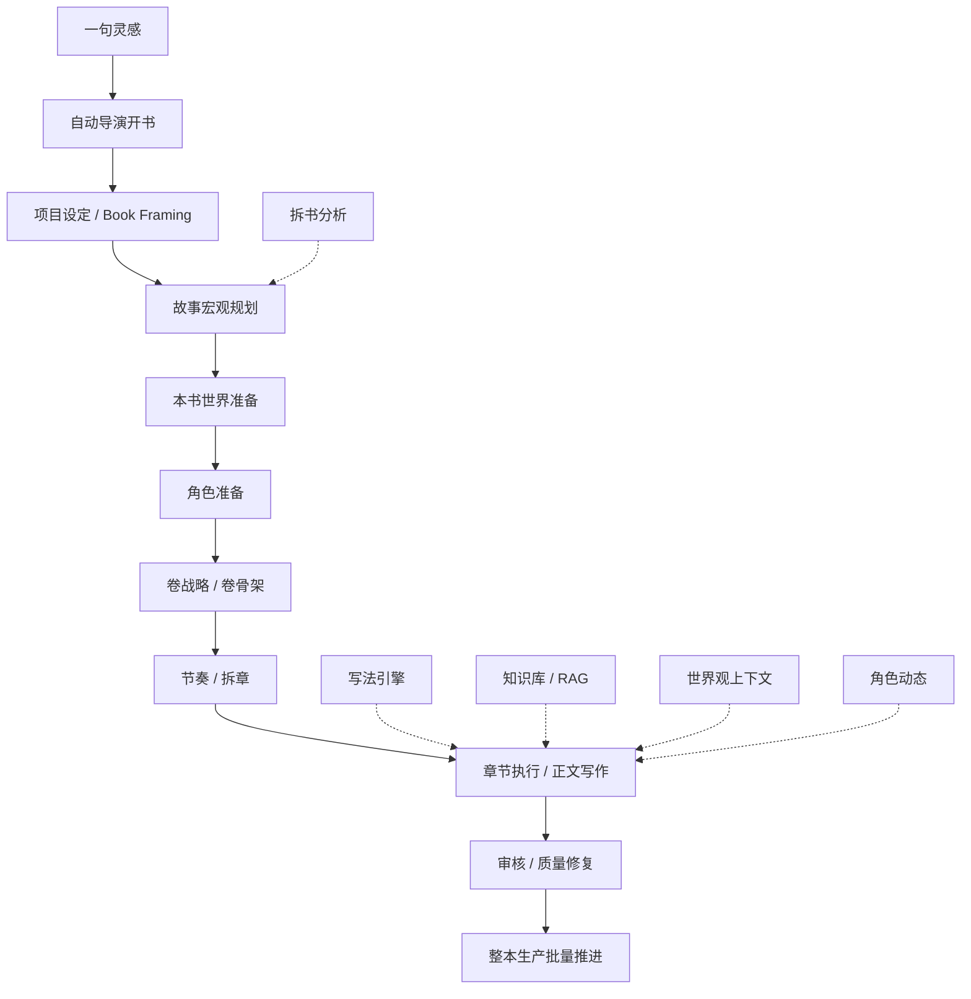
```mermaid
flowchart TD
    A["一句灵感"] --> B["自动导演开书"]
    B --> C["项目设定 / Book Framing"]
    C --> D["故事宏观规划"]
    D --> E["本书世界准备"]
    E --> F["角色准备"]
    F --> G["卷战略 / 卷骨架"]
    G --> H["节奏 / 拆章"]
    H --> I["章节执行 / 正文写作"]
    I --> J["审核 / 质量修复"]
    J --> K["整本生产批量推进"]
    
    L["写法引擎"] -.-> I
    M["知识库 / RAG"] -.-> I
    N["世界观上下文"] -.-> I
    O["角色动态"] -.-> I
    P["拆书分析"] -.-> D
```

---

### 关键设计亮点

1. **Prompt Registry 系统** — 所有业务 Prompt 集中在 `server/src/prompting/` 管理，注册 id/version/taskType/mode/contextPolicy/outputSchema，不允许在 service 里内联 Prompt
2. **自动导演链路** — 支持检查点恢复、项目接管、换模型重试、按阶段审核 vs 自动推进
3. **章节运行时** — 单章 Pipeline 包括生成上下文组装、正文写作、审校、修复、Artifact 同步
4. **Creative Hub** — LangGraph 编排的统一创作中枢，集成 Planner / Tool Registry / Runtime / 审批 / 中断恢复
5. **写法引擎** — 从文本提取写法特征 → 特征池 → 编辑组合 → 绑定到正文生成/检测/修正链路
6. **内容改编支线** — 漫画 (Comic) 和短剧 (Drama) 两个改编模块，通过解耦的 SourceContentPort 与小说数据对接

---

### 核心架构支柱

系统在 AI 编排之外构建了五个基础架构支柱，保障长篇创作在复杂多轮推进中的一致性、可恢复性和可观测性：

| 支柱 | 核心机制 |
| :--- | :--- |
| **物理记忆 (Memory)** | 实时将小说大纲状态与资产快照同步存盘至 `docs/story_board.json` 与 `docs/story_ledger.md`，保障单次会话外的记忆留存，支持断电/异常重启后从物理存盘重建 |
| **分支隔离 (Worktree)** | 引入 `ChapterDraft` 隔离草稿表，在 `WorktreeManager` 中隔离并行写作会话的读写，通过 `mergeAndCommit` 事务性合并入主干，防止写覆写 |
| **对抗监察 (Debate)** | `EditorAgent` 审核主笔生成的草稿，通过 Zod 强类型校验返回修文建议或阻止不合规草稿，构成主笔与监察双代理的对抗闭环 |
| **自诊断心跳 (Heartbeat)** | 后台定时轮询诊断器，定期检查小说整体一致性与质量缺陷，将自动分诊后的行动卡片持久化写入本地自检看板 `docs/STORY_TASKS.md` |
| **监控驾驶舱 (Cockpit)** | 前端实时展示协同智能体的健康度评分、行动建议卡片、自检心跳状态，以及主笔与监察代理对抗生成的实时弹幕滚动日志 |

### 模型网关与本地运行

系统通过 `ModelGateway` 实现业务层与具体模型底座的完全解耦：

- 所有核心任务类型（planner、writer、review、repair、replan、summary、fact_extraction、chat 等）通过 `ModelRouteConfig` 配置映射
- 支持透明转发至本地 Ollama 实例或远程 API（OpenAI、DeepSeek、SiliconFlow、xAI 等），规划、正文、审阅可按路由拆开配
- 前端设置页提供供应商 API Key 管理、模型路由配置和连通性测试
- 默认使用 SQLite 就能把主链先跑起来；如果要完整体验知识库/RAG，再按需接 Qdrant

### 当前系统关注点

- `Creative Hub` 负责统一创作中枢与 Agent 运行时体验
- `Novel Setup / Director` 负责从一句灵感走到整本可写
- `Novel Production` 负责整本生成主链
- `Style Engine` 负责写法资产、特征提取、绑定和反 AI 协同
- `Knowledge / Book Analysis / World` 负责长期上下文沉淀与回灌

## 当前路线图

当前最重要的不是继续堆零散功能，而是提高“小白把整本书写完”的成功率。

### P0

- 稳定自动导演连续执行，减少误停链、重复审校和异常 Token 消耗
- 让本书世界、角色、伏笔、时间线和章节任务稳定进入后续写作上下文
- 降低新手从一句灵感到可连续写章之间的判断成本和修复成本

### P1

- 提高整本一致性、节奏稳定性、人物成长质量和世界状态继承质量
- 让写法资产、世界约束、章节重规划、审阅反馈和质量债形成闭环
- 让系统更擅长“持续掌控整本书”，而不只是“生成某一章”

### P2

- 继续强化多阶段 Agent 协同和运行时可观察性
- 完善更自动化的生产调度、恢复策略、回合记忆和整本质量控制

## 交流反馈

如果你想反馈问题、交流使用体验，或者讨论自动导演、整本生产主链、写法引擎等方向，可以扫码加入 QQ 群。


## 贡献方式

如果你想参与这个项目，最有价值的贡献方向包括：

- 提升整本生产稳定性
- 改善新手开书体验和自动导演成功率
- 强化写法引擎、知识库回灌和世界观一致性链路
- 补充测试、错误回放和运行时可观察性

欢迎直接提 Issue 或 Pull Request。
提交 Pull Request 即表示你确认自己有权提交该内容，并已阅读且同意 [CLA.md](./CLA.md)；如果包含第三方代码、素材、AI 生成内容或其他受许可证约束的内容，请在 PR 中明确说明来源和许可证。详见 [CONTRIBUTING.md](./CONTRIBUTING.md)。

## 致谢

感谢提交修复 Pull Request 的贡献者 [@ystyleb](https://github.com/ystyleb)。


## 说明

- 这是一个持续快速迭代中的 AI Native 创作系统，功能边界仍在演化。
- README 优先描述当前最值得体验、最能代表方向的能力，而不是列出全部历史实现细节。
- 如果你更关心阶段目标、优先级和后续优化计划，请直接查看 [TASK.md](./TASK.md)。

## License

本项目采用双许可证授权模式：

- 默认情况下，本项目基于 GNU Affero General Public License v3.0 (AGPLv3) 授权，详见 [LICENSE](./LICENSE)；归属与附加说明见 [NOTICE](./NOTICE)。
- 服务型商用：将本项目（或其修改版本）作为后端以 SaaS、托管或其他形式向第三方提供服务，须通过作者获取商业授权许可。
- 请遵守开源协议条款，并在适用场景下取得相应授权。

贡献说明：新贡献默认按 [CLA.md](./CLA.md) 提交，可随项目按 AGPL-3.0-only 分发，并可纳入项目维护者另行提供的商业授权；详见 [CONTRIBUTING.md](./CONTRIBUTING.md)。
