<p align="center">
  
</p>

<h1 align="center">AI 小说创作工作台</h1>
<p align="center"><strong>Biz Novel Studio · 从一句灵感，走向一本完整小说</strong></p>
<p align="center">AI 帮你规划世界与角色、逐章写作、检查和保存，让长篇创作有一条可以继续走下去的路。</p>
<p align="center"><sub>Open-source AI novel writing assistant and long-form production studio.</sub></p>

<p align="center">
  <a href="https://github.com/ExplosiveCoderflome/AI-Novel-Writing-Assistant/releases/latest"></a>
  <a href="./LICENSE"></a>
  <a href="./package.json"></a>
</p>

<p align="center">
  
  
  
  
</p>

<p align="center">
  
  
  
  
</p>

<p align="center">
  <a href="https://trendshift.io/repositories/26664"></a>
</p>

<p align="center">
  <a href="https://github.com/ExplosiveCoderflome/AI-Novel-Writing-Assistant/releases/latest"><strong>下载 Windows 桌面版</strong></a> ·
  <a href="https://explosivecoderflome.github.io/AI-Novel-Writing-Assistant/">项目介绍与文档</a> ·
  <a href="#快速开始">第一次使用</a> ·
  <a href="#源码运行">源码运行</a> ·
  <a href="https://github.com/ExplosiveCoderflome/AI-Novel-Writing-Assistant/issues">问题反馈</a>
</p>

---

你只需要先有一个想法。这个工作台会帮你把方向、人物、世界和章节接起来，在创作过程中保留正文、设定与进度。长篇由自动导演持续推进，短篇走独立的完整成稿流程。它面向第一次写小说的人，也为需要维护长期资料、研究 AI 创作流程的作者与开发者提供更细的工具。

**桌面版适合直接开始写作；源码版适合开发和自行部署。** 模型需要使用你自己的 API 配置，知识库检索可按需启用。

[最新更新](#最新更新) · [能做什么](#现在已经能做什么) · [导演版本与模式](#导演版本与运行模式) · [Token 缓存优化](#token-缓存与调用优化) · [功能预览](#功能预览) · [文档导航](#文档导航) · [参与项目](#参与项目)

## 最新更新

### 2026-10-07

桌面版 **0.5.0** 于 2026-10-06 发布，主角是 **自动导演 V2**。这阵子更新间隔有点长，我把主要精力放在导演重构和连续生成调试上：模式为什么会变、保存后能不能接着写、Tokens 花在哪一步，都得在实际推进中跑清楚。这次文档整理，希望让第一次打开项目的人也能找到自己的入口。

#### 优化

- 下载安装、长篇与短篇首次创作、功能预览和开发资料提供独立入口，高级配置按需展开。
- 使用说明分别解释 V1/V2 与全自动／按阶段确认，补充章节范围、暂停恢复和用量阅读方法，并校正源码启动说明。
- 补充 Token 缓存与调用优化说明，介绍稳定资料、同章修文和有效审校结果的复用，并提供按阶段查看实际消耗的方法。
- 创作链图展示世界样本、角色库、写法引擎、反 AI 规则和知识库参与规划、正文生成及写后延续的位置。

#### 修复

- 项目首页顶部展示完整技术栈与 Trendshift 动态排名徽章，便于查看技术组成与榜单表现。

**0.5.0 升级速览**

| 你能直接感受到的能力 | 使用方式 |
| --- | --- |
| 自动导演 V2 | 按你授权的范围补齐规划、写正文、检查与保存；可选全自动或按阶段确认 |
| V1 与 V2 共存 | 开书时选择版本；两套导演分别管理任务和恢复进度，已有小说保留所属版本 |
| 跟随生成 | 自动打开正在写作的章节，实时查看正文输出；关闭后可自由阅读 |
| 本书 AI 用量 | 查看输入、输出、缓存命中与未命中 Tokens，按章节、步骤、厂商和模型追溯调用 |
| Token 缓存与调用优化 | 稳定规则与书级资料前置，同章修文复用未变化的输入，有效审校结果按条件复用，减少重复处理 |
| 更完整的小说资料 | 查看世界规则、势力、地点、角色动机，以及世界地图和角色关系图 |
| 连续创作与恢复 | 从保存进度继续，保留完成正文与质量提醒；后续批次沿用所选模式 |

[阅读 0.5.0 完整升级介绍](./docs/releases/release-notes.md#2026-10-06) · [查看全部历史更新](./docs/releases/release-notes.md)

## 现在已经能做什么

| 你想完成的事 | 工作台怎样帮助你 | 了解更多 |
| --- | --- | --- |
| 把一个点子变成一本书的方向 | 自动导演整理题材、卖点、人物目标和候选方向；也可从热门题材或完成的拆书起步 | [小说与开书入口](./docs/public/modules/novels.md) |
| 写一篇完整短篇 | 从想法与方向选择进入 3,000—30,000 字短篇生产，连续阅读、修改和导出；也可另建长篇延展原故事 | [短篇使用路径](#写一篇完整短篇) |
| 持续写出后续章节 | V2 围绕授权范围推进近期规划、章节任务、场景、正文、检查与保存；V1 保留原工作流程 | [版本与模式说明](#导演版本与运行模式) |
| 维护同一本书的世界与人物 | 保存本书世界、角色、关系和章节状态，查看世界地图与角色关系图，为后续创作提供资料 | [世界样本库](./docs/public/modules/world-sample-library.md) · [角色库](./docs/public/modules/character-library.md) |
| 控制作品的表达方式 | 写法资产与反 AI 规则参与正文生成、检查和局部修文；检测与自动修正按本书设置生效 | [写法引擎](./docs/public/modules/style-engine.md) · [反 AI 规则](./docs/public/modules/anti-ai-rules.md) |
| 学习参考作品并复用资料 | 拆书分析结构、人物与写法，回溯原文证据；结果可用于知识库、写法资产或参考开书 | [拆书工作台](./docs/public/modules/book-analysis.md) |
| 让长期资料参与写作 | 知识库与 RAG 检索召回相关资料，配合本书世界、角色和写法组装章节上下文 | [知识库](./docs/public/modules/knowledge-base.md) |
| 看懂 AI 在做什么、消耗多少 | AI 实况查看执行过程并在断线后重连；V2 小说用量页查看已记录的调用消耗；运行记录查看进度与来源 | [运行记录](./docs/public/modules/task-center.md) · [用量说明](#ai-用量怎么看) |
| 减少连续创作中的重复消耗 | 稳定资料与动态剧情分开组织，保留可复用的输入前缀，并减少相同条件下的重复审校 | [Token 缓存与调用优化](#token-缓存与调用优化) |
| 让不同任务使用合适的模型 | 在页面配置供应商、连接测试与模型路由，为规划、正文、审阅、拆书分别选择模型 | [模型设置](./docs/public/modules/system-settings.md) · [模型路由](./docs/public/modules/model-routing.md) |
| 把小说延展成其他素材 | 从已有章节、人物与场景整理漫画分镜、角色视觉资产和短剧素材 | [漫画](./docs/public/modules/comic-workspace.md) · [短剧](./docs/public/modules/short-drama-workspace.md) |

创作中枢 **Creative Hub** 也提供对话式的创作引导、规划和工具调用，帮助你找到下一步。漫画与短剧适合在小说主线、角色和章节内容明确之后使用。[了解创作中枢](./docs/public/modules/creative-hub.md)

## 导演版本与运行模式

**长篇创作先选导演版本，再选这次怎样推进。V2 不等于全自动，V1 也不等于手动。** 短篇使用独立流程，不参与导演版本选择。

### V1 与 V2 怎么选

| | 导演 V1 | 导演 V2 |
| --- | --- | --- |
| 使用入口 | 原导演与小说工作台，保留熟悉的分阶段创作入口 | 本书导演台，集中阅读目录、正文和资料，并推进下一段创作 |
| 适合情况 | 继续原有小说，或希望沿用原工作台操作 | 从新书开始，按授权范围连续规划和生成 |
| 任务与恢复 | 使用自己的任务、检查点与恢复流程 | 使用自己的运行、阶段结果与保存进度 |
| 版本选择 | 历史小说保留所属版本 | V2 可用时，新书默认优先选择 V2 |

开书页可以选择可用的导演版本。已有小说需要先结束当前创作，再在本书设置切换；已保存正文与历史记录会保留。**切换版本只保存选择，不会自动开始生成，也不会恢复另一个版本的旧任务。**

桌面版提供 V1/V2 选择；源码部署需启用 `DIRECTOR_NEXT_ENABLED=true`。此开关只控制 V2 是否可用，不会替已有小说更换导演。

### V2 的全自动与按阶段确认

| 创作方式 | AI 怎样推进 | 你需要做什么 |
| --- | --- | --- |
| **全自动推进** | 在本次授权范围内补齐所需规划，写正文、检查和保存，普通阶段结果自动继续 | 先选择方向和范围；遇到明确暂停事项时处理，再从本书导演台继续 |
| **按阶段确认（半自动）** | 在需要确认的阶段保存结果，等待你核对后继续；正文在批次收尾确认 | 打开本阶段结果，核对后点击确认；无需逐章手动触发整条链 |

书名旁与导演台顶部会显示当前方式，后续正文批次沿用所选模式。V2 的阶段确认在本书导演台完成；“运行记录”负责查看状态和打开来源页，继续、恢复、取消等操作在来源工作台处理。

### 全自动为什么也可能停下

全自动会继续执行你授权的范围，**范围完成后需要你选择下一段**。例如提交第 1—3 章，完成后不会擅自写第 4 章。

遇到模型不可用、需要重新规划、用量保护或数据完整性问题时，系统也可能暂停。普通局部质量问题默认记录为章节提醒并继续；如果明确选择“质量优先”的处理策略，则可能在正文保存后等待人工处理。

V2 单章安全上限为 **100,000 Tokens**，累计包含该章的生成、检查与修文调用，也包含缓存命中的输入。它不是“正文应消耗的目标值”，与整次创作预算不同。达到上限时应结合本书用量查看原因；已有保存结果会保留，继续操作从本书导演台进行。

## 快速开始

### 下载安装

普通写作使用推荐 Windows 桌面版，无需安装 Node.js、pnpm 或手动启动服务端。

| 选择 | 下载文件 | 适合谁 |
| --- | --- | --- |
| 安装版 | `Biz-Novel-Studio-<版本>-setup-x64.exe` | 长期使用，按安装向导完成安装 |
| 便携版 | `Biz-Novel-Studio-<版本>-portable-x64.exe` | 希望从独立目录直接启动 |

**[前往最新桌面版下载页 →](https://github.com/ExplosiveCoderflome/AI-Novel-Writing-Assistant/releases/latest)**

### 选择创作入口

| 想写什么 | 从哪里进入 |
| --- | --- |
| 连续推进的长篇小说 | 小说列表或首页的“AI 自动导演开书”，新书可选择 V2 |
| 一次读完、有完整结局的短篇 | 小说列表或首页的“创作短篇”，由 AI 整理方向与篇幅 |
| 参考一本作品开新书 | 先完成拆书，再从“照着一本书写”进入开书 |

### 用 V2 写出第一段正文

1. **配置模型。** 在系统设置填写供应商、API Key、API 地址和文本模型，完成连接测试；首次使用先确保一个模型可用。
2. **输入灵感。** 从小说开书入口选择 V2，输入故事想法。没有想法时可先看热门题材，有参考作品时可从完成的拆书进入。
3. **选择方向。** 查看候选方案和标题，选定这本书想写成的样子，再进入本书导演台。
4. **选择推进方式与范围。** 想让 AI 连续推进就选全自动，想核对阶段结果就选按阶段确认；先提交一小段章节，观察正文效果与用量。
5. **查看并继续。** 勾选“跟随生成”观看正文流式输出。范围结束后检查已保存章节，选择下一段；出现暂停时阅读原因，从本书导演台处理。

写法引擎、知识库和高级模型路由可以在跑通第一段正文后逐步配置。[安装与准备](./docs/public/installation.md) · [热门题材雷达](./docs/public/modules/market-radar.md) · [参考作品开书](./docs/public/modules/book-analysis.md)

### 写一篇完整短篇

配置好模型后，打开“创作短篇”，输入想法，让 AI 推荐方向与篇幅；选择方向后开始生成。调整篇幅或创作方向时，先让 AI 重新适配方案，再确认生产。

短篇按内部片段生成，阅读与导出呈现连续正文；成稿后进行全篇检查和至多一次必要修复。你可以直接编辑，也可以提出修改要求，核对 AI 的修改范围后确认。“发展成长篇”会创建新作品，保留原短篇。

### AI 用量怎么看

在 V2 本书顶部或书架打开 **“AI 用量”**，先看全书已记录用量，再按章节、步骤、厂商、模型或状态筛选调用。规划、正文、审阅和修文都可能产生消耗，不能只按最终正文长度判断。

- **总 Tokens = 输入 Tokens + 输出 Tokens。** 缓存命中与未命中属于输入，不要再加一次。
- 缓存统计以厂商返回为准；没有提供的统计显示未知，不能当作零。固定规则与稳定资料更容易复用，正文和章节任务变化时命中率可能不同。
- 用量页覆盖已记录的调用；未记录的旧历史不会被估算补齐。Tokens 是调用计数，实际费用以厂商账单为准。

### 遇到暂停或错误

先查看本书导演台的暂停原因，再从对应工作台处理；需要追溯时打开“运行记录”查看状态和来源。保存的正文与任务进度有独立边界，重复点击生成不能代替恢复。

[常见问题](./docs/public/faq.md) · [故障排查](./docs/public/troubleshooting.md)

## Token 缓存与调用优化

长篇创作会反复使用本书约定、写法与世界规则。工作台把可复用的规则和书级、卷级资料放在输入前部，再附上本章任务、当前状态与正文，为模型供应商复用相同前缀提供条件。缓存复用的是已处理过的输入，正文仍由模型基于本次任务生成。

### 哪些部分做了优化

- **稳定资料前置。** 表达规则、作品约定和适用的世界规则按复用范围组织；每次读取当前资料，修改设置后后续调用使用新内容。
- **同章修文复用前缀。** 局部修文把本次修复重点放在同章资料和正文之后，资料与正文未变化时更容易复用前缀，同时保留写法、世界约束和秘密边界。
- **有效审校结果复用。** 正文、创作约定、检查规则、模型与参数等相关条件一致时，复用有效的检查结果，减少相同请求的重复调用。这与厂商的输入缓存是两种机制。
- **减少无效修文与复验。** 检查区分必须修复的缺口和普通表达建议，结合修改位置与实际效果处理局部问题，避免反复改整章；默认完成优先策略下，残余局部问题保留为质量提醒。

### 不同步骤，复用空间不同

| 步骤 | 可以复用的主要资料 | 必须随创作更新的内容 |
| --- | --- | --- |
| 章节规划 | 书级定位、作品约定、适用的卷级目标 | 本章任务、近期结果、人物状态 |
| 正文生成 | 写法与表达规则、作品约定、适用的世界规则 | 上章接续、本章事件、场景和人物状态 |
| 章节检查 | 检查标准、同章任务与约定 | 当前待检查正文与修文结果 |
| 局部修文 | 本书写法、同章资料、未变化的正文 | 本次问题证据、修复重点和追加要求 |
| 写后资料整理 | 抽取规则、确实未变化的相关资料 | 新正文、角色变化、资源与伏笔状态 |

正文需要输入新的剧情和状态，这部分未命中是正常成本。首次调用、切换模型或通道、修改书级资料，也可能让命中量发生变化。优化效果应结合正文质量、输入命中与未命中 Tokens、输出 Tokens、调用次数和单章总用量一起判断。

### 从哪里查看实际效果

在本书 **“AI 用量”** 中筛选同一章节、步骤与模型，比较连续调用的输入、输出、命中和未命中 Tokens。也可以在 **AI 实况** 中查看正在执行的调用。

**缓存命中与未命中都属于输入 Tokens，不在总用量之外重复相加。** 缓存统计以厂商实际返回为准，未提供的字段显示未知；缓存收益受厂商、模型与通道的机制影响，不能承诺固定命中率或节省比例。命中量仍计入单章安全预算，实际费用以厂商账单为准。

面向开发者的详细边界见[模型输入缓存 Wiki](./docs/wiki/prompts/llm-input-cache.md)与[小说 AI 用量说明](./docs/wiki/workflows/novel-ai-usage.md)。

## 功能预览

以下截图展示现有功能示例，包含 V1 工作台与资料工具；界面与当前版本可能有差异。V2 的入口、模式与操作以[上方使用说明](#导演版本与运行模式)为准。

### 章节写作与拆书

| V1 章节执行工作台 | 拆书与参考资料 |
| --- | --- |
| 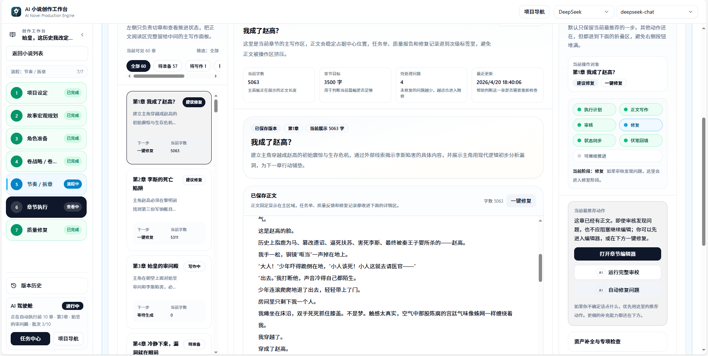 | 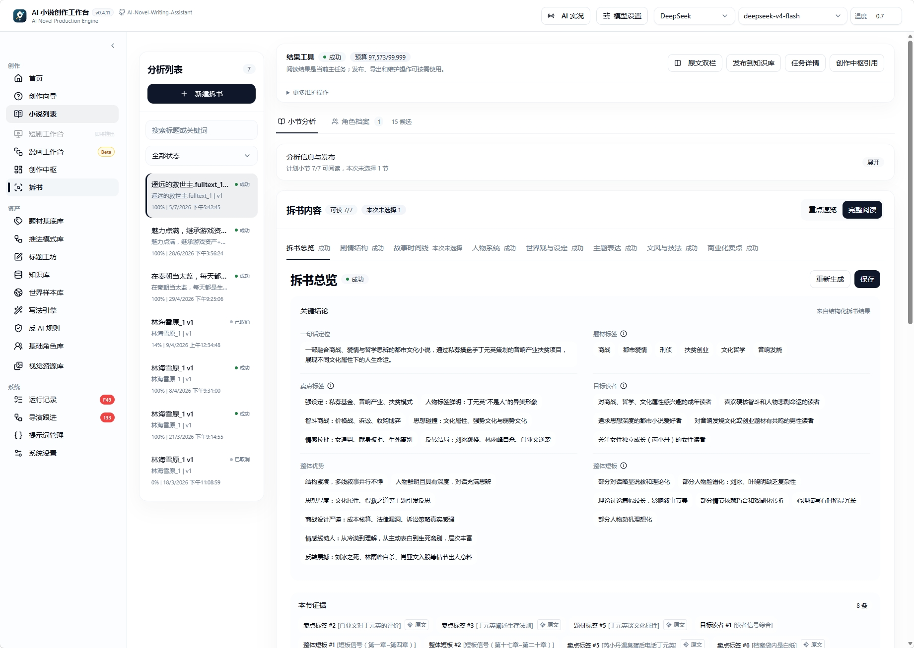 |
| 正文、章节任务与检查结果围绕同一章组织。 | 从作品结构和原文证据中整理可复用的创作资料。 |

<details>
<summary><strong>展开：开书方向与 V1 分阶段工作台</strong></summary>

### 开书方向选择

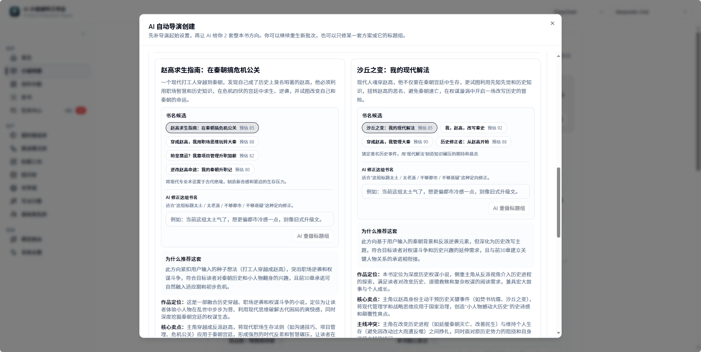

### V1 的故事规划与角色准备

| 故事宏观规划 | 角色准备 |
| --- | --- |
| 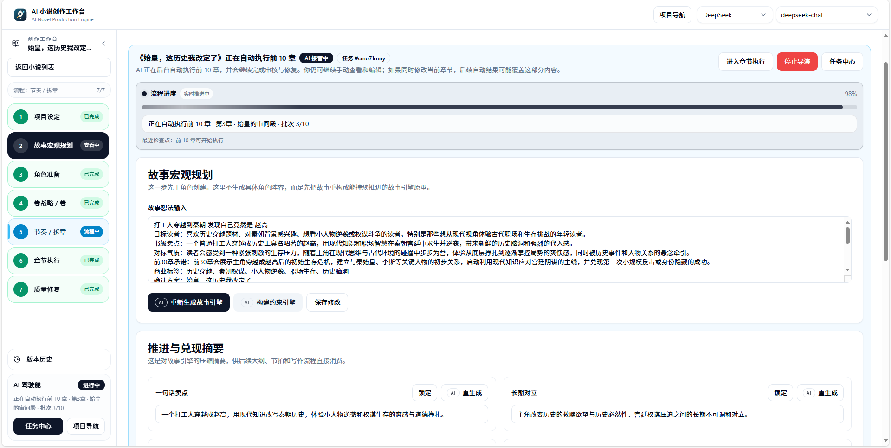 | 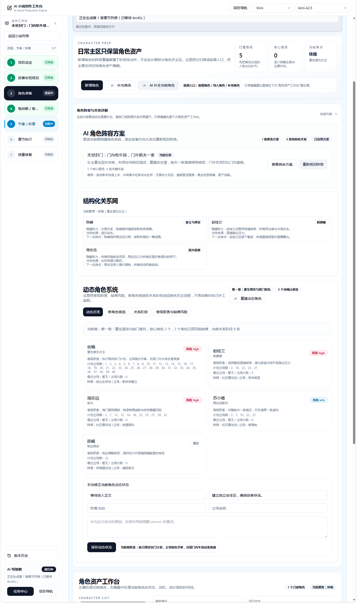 |

### V1 的卷规划与节奏拆章

| 卷战略 | 节奏与章节规划 |
| --- | --- |
| 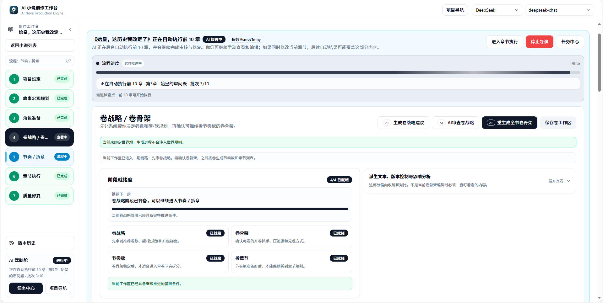 | 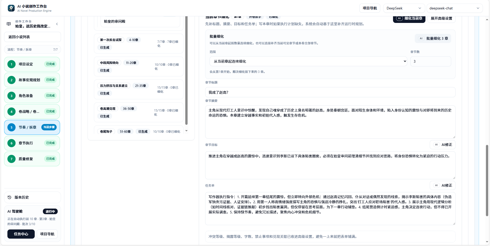 |

</details>

<details>
<summary><strong>展开：世界资料、写法与模型配置</strong></summary>

### 世界资料与可视化

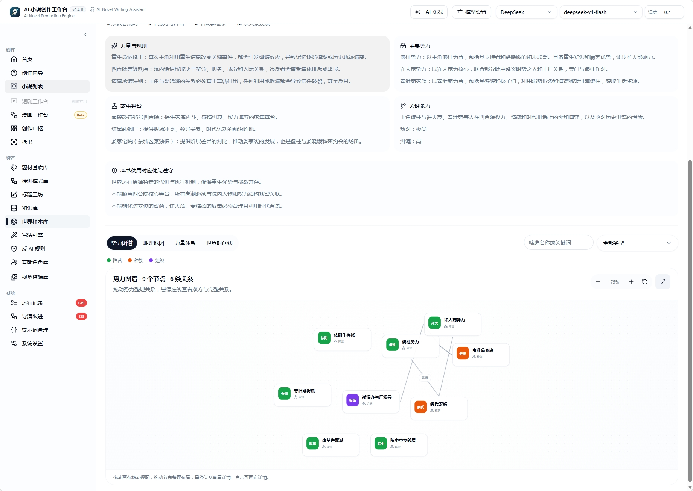

### 写法引擎与反 AI 规则

| 写法资产 | 表达规则 |
| --- | --- |
| 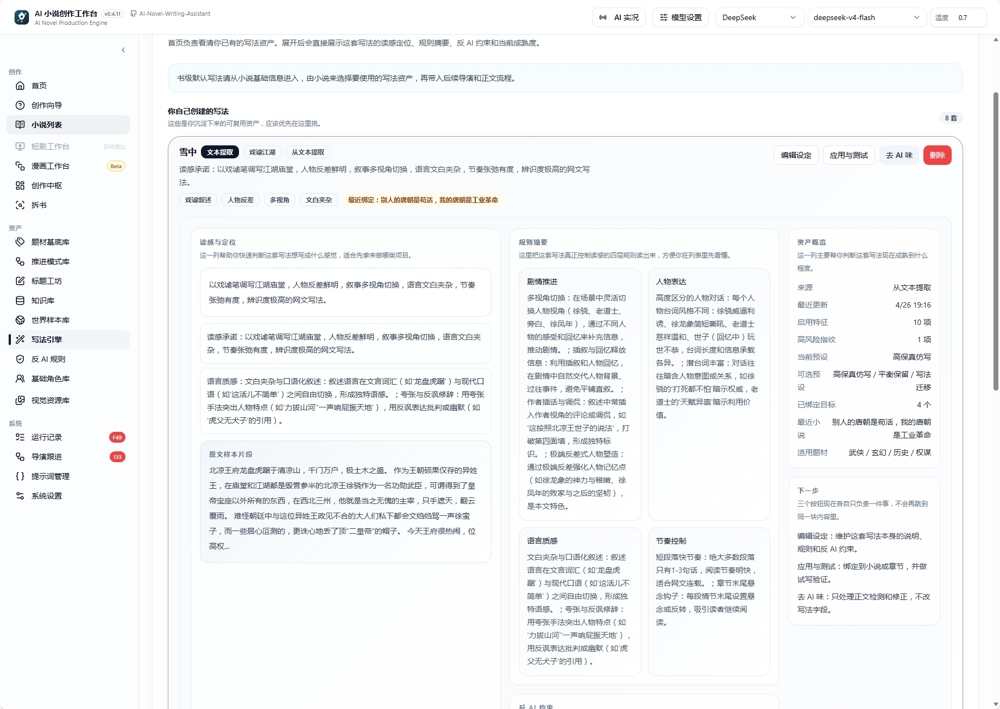 | 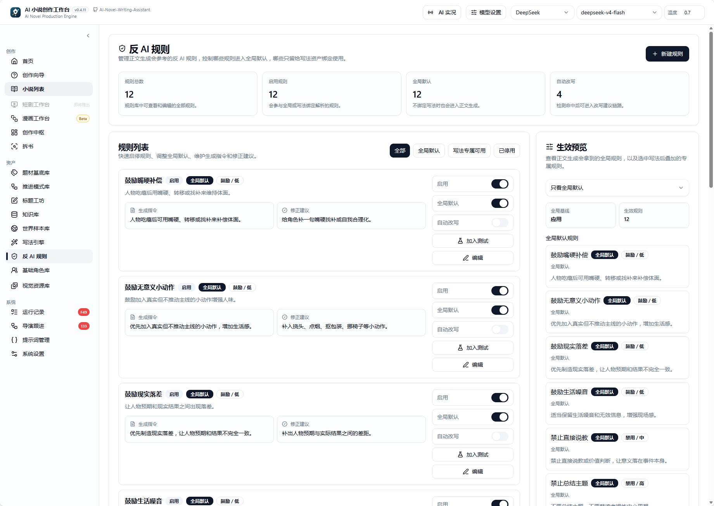 |

### 模型配置

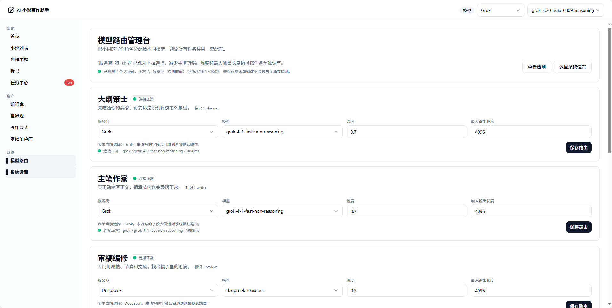

</details>

## 从灵感到章节的创作链

下面展示长篇的持续创作路径。实线表示创作推进，虚线表示按需导入资料或提供约束；短篇进入独立的计划、生成与全篇检查流程。

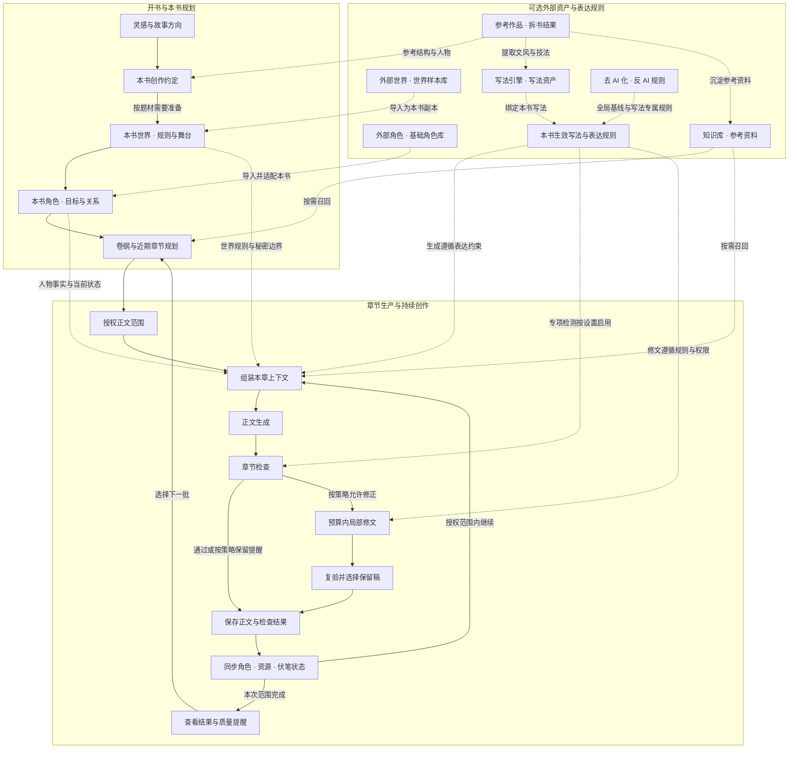

- **外部世界与角色：** [世界样本](./docs/public/modules/world-sample-library.md)导入为本书世界副本，[角色库](./docs/public/modules/character-library.md)资产导入为本书角色，按当前故事调整；本书剧情变化保留在书内，长期资产由你决定是否同步。
- **写法与去 AI 化：** [写法引擎](./docs/public/modules/style-engine.md)与[反 AI 规则](./docs/public/modules/anti-ai-rules.md)提供生效的表达约束。专项检测按设置加入章节检查；需要修正时，沿用局部修文流程与规则权限，只提醒的规则保留为质量提醒。
- **参考资料与状态回流：** 拆书和知识库提供按需参考，每章写后同步的人物、资源和伏笔状态参与后续章节，帮助连续创作承接已发生的剧情。

V1 与 V2 分别编排这条链，已保存的小说资料可以复用。章节检查与修文按本次质量策略执行，暂停与恢复方式见[使用说明](#遇到暂停或错误)。

<details>
<summary><strong>查看生产链与交互架构图</strong></summary>


[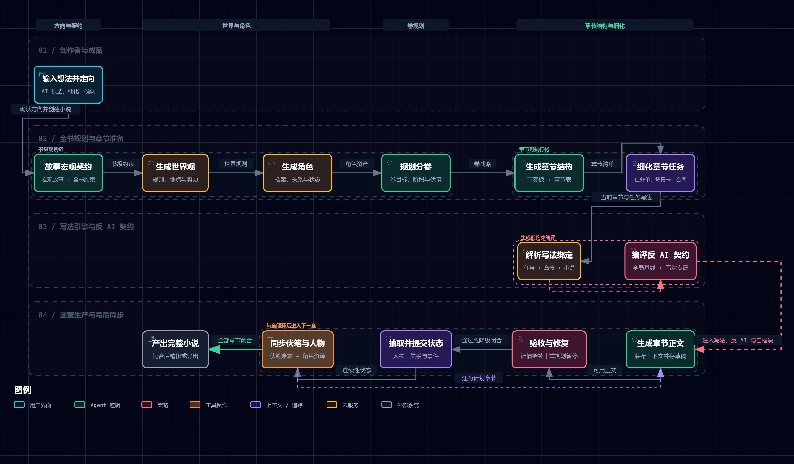](https://explosivecoderflome.github.io/AI-Novel-Writing-Assistant/architecture/auto-director-idea-to-novel.detailed.workflow.html)

[打开交互架构图](https://explosivecoderflome.github.io/AI-Novel-Writing-Assistant/architecture/auto-director-idea-to-novel.detailed.workflow.html) · [图表源数据](./docs/architecture/auto-director-idea-to-novel.detailed.workflow.json)

交互图由 [Archify](https://github.com/tt-a1i/archify) 生成，展示产品生产链的细节；V2 的独立运行与恢复规则见[开发 Wiki](./docs/wiki/workflows/director-version-isolation.md)。

</details>

## 文档导航

| 你想了解什么 | 从这里开始 |
| --- | --- |
| 下载、模型准备与第一次启动 | [安装与准备](./docs/public/installation.md) · [模型设置](./docs/public/modules/system-settings.md) |
| V2 的首次创作与模式选择 | [本文快速开始](#快速开始) · [版本与运行模式](#导演版本与运行模式) |
| 短篇生成与后续修改 | [短篇使用路径](#写一篇完整短篇) · [短篇工作流开发说明](./docs/wiki/workflows/creation-studio-short-story.md) |
| Token 缓存优化与消耗统计 | [缓存与调用优化](#token-缓存与调用优化) · [AI 用量读法](#ai-用量怎么看) |
| V1 的分阶段创作路径 | [第一本小说实操路径](./docs/public/playbook/first-novel-walkthrough.md) · [自动导演阶段全景](./docs/public/flow/auto-director-pipeline.md) |
| 维护写法、人物和资料 | [写法引擎](./docs/public/modules/style-engine.md) · [角色库](./docs/public/modules/character-library.md) · [知识库](./docs/public/modules/knowledge-base.md) |
| 任务异常与恢复 | [故障排查](./docs/public/troubleshooting.md) · [运行记录](./docs/public/modules/task-center.md) · [V1 按阶段恢复](./docs/public/playbook/recovery-by-phase.md) |
| 原理、模块边界与开发规范 | [开发 Wiki](./docs/wiki/README.md) · [文档目录](./docs/README.md) · [协作规则](./AGENTS.md) |
| 历史更新与后续方向 | [完整更新记录](./docs/releases/release-notes.md) · [当前路线图](./TASK.md) |

也可以在[在线文档站](https://explosivecoderflome.github.io/AI-Novel-Writing-Assistant/)搜索模块与使用问题。

## 源码运行

### 环境要求

| 项目 | 要求 |
| --- | --- |
| Node.js | `^20.19.0 \|\| ^22.12.0 \|\| >=24.0.0`，与根目录 `package.json` 一致 |
| pnpm | `>=10.6.0`，仓库声明使用 `pnpm@10.6.0` |
| 文本模型 | 至少一组可用 API 配置，可在启动后填写 |
| 数据库 | 默认本地 SQLite；可通过服务端配置使用 PostgreSQL |
| 知识库检索 | 可选 Qdrant 与 Embedding 模型，不是首次写作的前置条件 |

### 安装与启动

```bash
git clone https://github.com/ExplosiveCoderflome/AI-Novel-Writing-Assistant.git
cd AI-Novel-Writing-Assistant
pnpm install
```

复制服务端配置文件，任选与你的终端对应的一条：

```powershell
# Windows PowerShell
Copy-Item server/.env.example server/.env
```

```bash
# macOS / Linux
cp server/.env.example server/.env
```

在 `server/.env` 中确认：

```env
# 开放 V1/V2 选择；新书优先 V2，已有小说保留原版本
DIRECTOR_NEXT_ENABLED=true

# 尚未配置 Qdrant 时关闭检索，先跑通创作
RAG_ENABLED=false
```

然后在仓库根目录启动：

```bash
pnpm dev
```

前端默认为 `http://localhost:5173`，服务端为 `http://localhost:3000`。首次开发启动会准备 Prisma Client 与数据库结构，通常无需先手动执行数据库命令；如需连接已有数据库，先核对配置并保留备份。启动后打开系统设置配置并测试模型。

Web 开发默认通过 Vite 的同源 `/api` 代理访问服务端，同机与局域网访问通常无需创建 `client/.env`。前后端分开部署或需要指定其他服务端时，才设置 `VITE_API_BASE_URL`。

### 常用命令

| 命令 | 用途 |
| --- | --- |
| `pnpm dev` | 启动共享包、服务端和 Web 客户端 |
| `pnpm dev:desktop` | 启动桌面开发环境，首次按需准备 Electron 运行时 |
| `pnpm dev:site` | 预览公开介绍与文档站 |
| `pnpm build` | 构建共享包、服务端和 Web 客户端 |
| `pnpm typecheck` | 检查共享包、服务端、客户端和桌面端类型 |
| `pnpm test` | 运行服务端快速测试 |
| `pnpm test:client` | 运行客户端测试 |
| `pnpm check:docs-manifest` | 检查公开文档清单与阶段说明 |

完整命令以[根目录 package.json](./package.json)为准；测试范围与隔离规则见[后端测试说明](./docs/architecture/testing.md)。

<details>
<summary><strong>高级配置：环境变量、知识库与安装排查</strong></summary>

### 配置文件在哪里

- 服务端读取 `server/.env`；前端读取 `client/.env` 或 `client/.env.local`。
- 根目录 `.env.example` 用作总览，不能代替子包配置。
- API Key 和模型可以在系统设置保存；模型路由用于分别配置规划、正文、审阅和拆书。
- 默认 SQLite 连接为 `file:./dev.db`；已有数据的位置由实际运行配置决定，桌面版与源码版的数据目录不同。

### 前后端分开运行

如果前端需要连接另一台机器上的 API，在 `client/.env` 中填写：

```env
VITE_API_BASE_URL=http://your-server:3000/api
```

更改 Vite 环境变量后重新启动前端。服务端端口、绑定地址和跨域配置见 [server/.env.example](./server/.env.example)；正式 Web 部署还需要按实际域名设置访问边界。

### 启用知识库检索

准备 Qdrant 地址与凭据，在 `server/.env` 中配置：

```env
RAG_ENABLED=true
QDRANT_URL=http://127.0.0.1:6333
QDRANT_API_KEY=
```

使用远程实例时替换地址和凭据。启动后在“知识库 → 向量设置”配置 Embedding 模型与集合，再导入并索引资料。[知识库使用说明](./docs/public/modules/knowledge-base.md)

### 安装卡住或桌面运行时未准备

先检查 Node 版本与包管理器配置：

```bash
node -v
pnpm -v
pnpm config get script-shell
npm config get script-shell
```

如果 `script-shell` 配置为 `cmd.exe /k`，安装脚本可能停在交互式提示符；移除该自定义设置后重开终端再安装。桌面开发首次需要下载 Electron 运行时，网络不可用时先处理代理或镜像；也可单独执行 `pnpm run prepare:desktop-runtime`。

</details>

## 技术栈与架构

| 层级 | 主要技术 |
| --- | --- |
| 客户端 | React 19、Vite、TypeScript、TanStack Query、Plate |
| 服务端 | Express 5、Prisma、Zod |
| AI 与工具编排 | LangChain、LangGraph、产品级 Prompt Registry |
| 桌面端 | Electron |
| 数据与检索 | SQLite / PostgreSQL、Qdrant |
| 工程组织 | pnpm workspace |

```text
client/   Web 界面、小说工作台与导演台
server/   API、模型调用、导演与章节生产
shared/   前后端共享类型与运行契约
desktop/  Electron 壳、桌面运行与打包
site/     公开介绍站与文档导航
docs/     使用文档、开发 Wiki、设计与发布记录
scripts/  启动、验证与工程脚本
images/   功能预览与文档截图
```

V2 内核位于 `server/src/modules/director/`，业务能力由应用层接入；V1 保留自己的编排模块。两者共用已保存的小说资产与底层章节能力，任务、恢复和版本归属独立管理。[版本隔离规则](./docs/wiki/workflows/director-version-isolation.md) · [模块边界](./docs/wiki/architecture/module-boundaries.md) · [章节生产链](./docs/wiki/workflows/chapter-production-chain.md)

## 参与项目

欢迎通过 [Issues](https://github.com/ExplosiveCoderflome/AI-Novel-Writing-Assistant/issues)反馈问题，或提交 Pull Request。优先关注连续生成与恢复、新手开书体验、长篇一致性和可追溯的模型用量。反馈时附上使用版本、所选导演与模式、操作步骤和相关日志，会更容易定位问题。

提交贡献前请阅读 [CONTRIBUTING.md](./CONTRIBUTING.md) 与 [CLA.md](./CLA.md)，并说明第三方代码、素材及其许可证。感谢参与测试、提出建议和提交修复的朋友，也感谢贡献者 [@ystyleb](https://github.com/ystyleb)。

### 交流与支持

<details>
<summary><strong>展开：QQ 交流群与支持项目</strong></summary>

想交流创作体验、自动导演或项目开发，可以扫码加入 QQ 群。如果工作台对你有帮助，也欢迎支持持续开发与维护。

| QQ 交流群 | 支持项目（支付宝） |
| --- | --- |
|  |  |

</details>

### 在 Codex 中创作：Ani Book Skill

希望直接在 Codex 的本地文件工作区推进长篇，可以了解配套的 [Ani Book Skill](https://github.com/ExplosiveCoderflome/ani-book-skill)，通过阶段工件持续规划、写作和审校。本仓库提供可视化工作台，两种入口按你的使用习惯选择。

## License

本项目采用双许可证授权模式：

- 默认基于 GNU Affero General Public License v3.0（AGPLv3）授权，详见 [LICENSE](./LICENSE)；归属与附加说明见 [NOTICE](./NOTICE)。
- 服务型商用：将本项目或其修改版本作为后端，以 SaaS、托管等形式向第三方提供服务，须通过作者获取商业授权许可。
- 新贡献默认按 [CLA.md](./CLA.md) 提交，可随项目按 AGPL-3.0-only 分发，也可纳入维护者另行提供的商业授权。

[贡献与授权说明](./CONTRIBUTING.md) · [LINUX DO](https://linux.do/)
