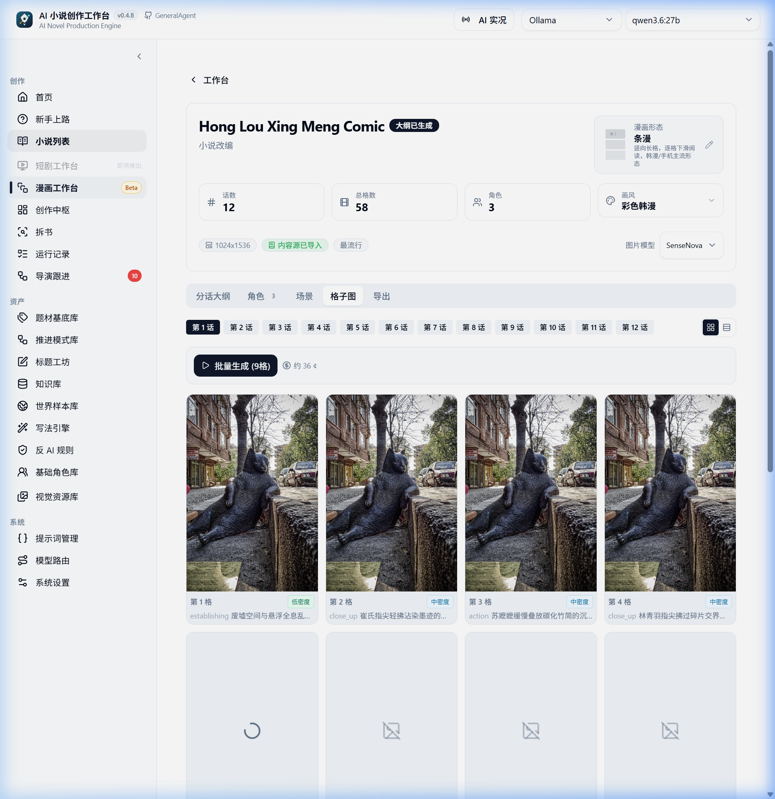
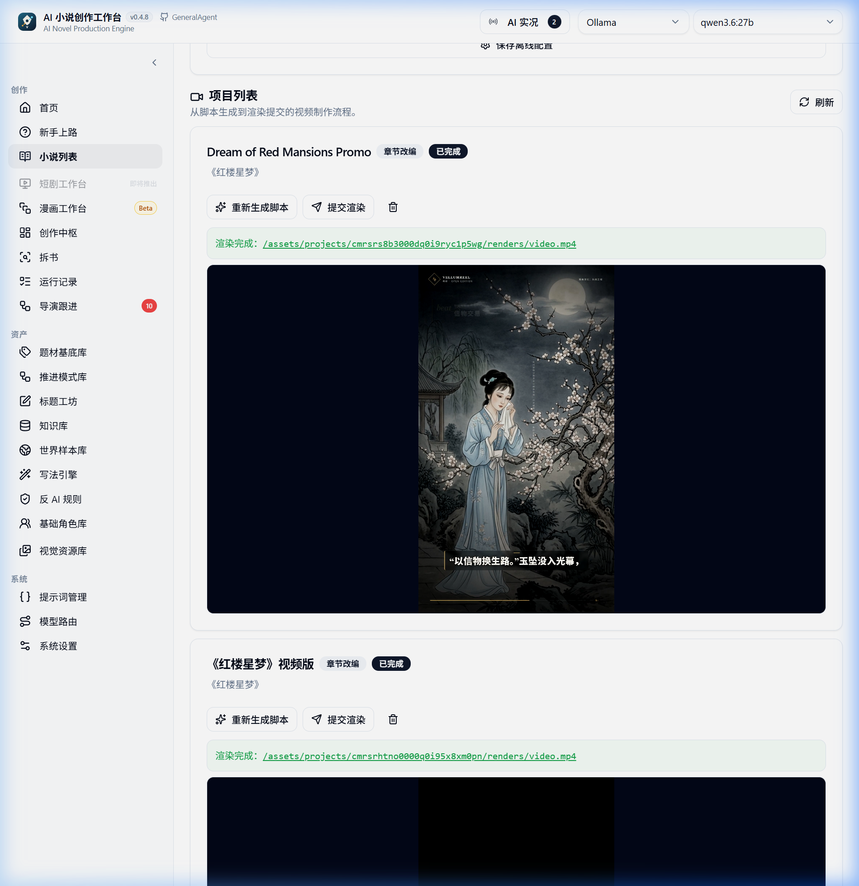

# Daydream Engine (白日做梦引擎)
一个旨在将人类想象力与故事世界具现化的多功能智能体多模态模拟沙盘。

Languages: [English](README.md) | [简体中文](README_zh.md)

当前开发主线：
`Creative Hub + 自动导演开书 + 本书世界上下文 + 整本生产主链 + 写法引擎`


---

## 🌌 项目愿景与路线图：白日做梦的连续谱

白日做梦引擎（Daydream Engine）不是一个普通的“你写一句、AI补一句”的聊天或编辑器外壳。它的核心设计理念是：把创意写作与生成看作一个多阶段的“编译”和“沙盘演化”过程：


1. **小说整本生产 (第一步 - 目前实现最充分的一步)**
   将单句的灵感自动导演，规划出方向、世界设定、角色网、卷纲和章节，并提供自动写作、审校、修复与状态回灌的闭环生产链。
2. **小说生成漫画**
   提取小说的场景设定与角色视觉特征，保持画面一致性，自动输出分镜面板并生成连贯的漫画资产。
3. **漫画变成分镜剧本**
   将画面序列和剧情节奏解构为专业级别的影视分镜剧本，包含镜头轨迹、对话旁白、舞台调度与配音指令。
4. **分镜生成短剧 (VellumReel 改编工坊)**
   集成高保真本地语音合成（TTS）、音视频对齐与渲染引擎，将剧本一键合成生成 9:16 竖版视频。
5. **电影级大片**
   向大屏幕演进，扩展本地视频生成模型，提供可控的宏大场景、音轨混合与镜头生成链路。
6. **终极目标：世界沙盘 (虚拟西部世界)**
   将小说里的角色、阵营、地理和物理/魔法法则全部映射到一个演化沙盘（Sandbox）中。在这个虚拟“西部世界”里，智能体们拥有长期记忆和个人动机，在网格上自主交互、做出决策并发生冲突。系统将自动记录并生成编年史，源源不断地自动生成无限的故事。

适合**完全不懂写作的新手**走完一本长篇创作并进行视觉延展，也适合研究 AI Native 应用、Agent Workflow、LangGraph 编排和长链路任务的开发者参考。

---

## Windows 桌面版

如果你想直接下载安装运行：
- 下载入口：[GitHub Releases](https://github.com/winnerineast/GeneralAgent/releases)
- 最新版本页：[Latest Release](https://github.com/winnerineast/GeneralAgent/releases/latest)
- 建议优先下载 `Setup.exe` 安装版。
- 公开介绍站：[GitHub Pages 介绍站](https://winnerineast.github.io/GeneralAgent/) 提供功能预览、模块文档和使用指南。

## 本地 Codex 创作：Ani Book Skill

如果你希望直接在 Codex 的本地工作区中推进创作，可以使用 [Ani Book Skill](https://github.com/ExplosiveCoderflome/ani-book-skill)。
- 需要可视化工作台、模型配置和小说/漫画多模态工坊：使用本仓库。
- 偏好在本地通过 Codex 文件和流程进行无界面纯创作：前往 [Ani Book Skill](https://github.com/ExplosiveCoderflome/ani-book-skill)。

---

## 🛠️ 已实现功能 (What Has Been Done)

### 1. AI 自动导演开书与四种运行模式
- 从一句灵感直接进入自动导演，无需先手写设定；系统整理项目设定、对齐书级 framing，生成多套整本方向与标题组。
- 方向不满意时可以局部修订，支持单独重做标题组。
- 四种运行模式：**先准备到可开写**（推荐首本书）、**全书自动成书**、**按范围执行**（全书/前N章/指定卷）、**正文后去 AI 检测与修正**（质量闭环）。
- 全自动模式下提供智能检查点：遇到配额耗尽或修复失败会主动暂停并保存状态，支持无缝接管与恢复。
- 批量运行后自动确认 pending 角色，角色信息灌回名册以消除后续生成中的一致性漂移。

### 2. Creative Hub 与 Agent Runtime
- 统一创作中枢承载对话、追问、规划、工具调用和回合总结。
- 采用 LangGraph 编排，包含 Planner、Tool Registry、Runtime、审批节点和中断恢复链路。
- checkpoint 到达时自动弹出浏览器暂停通知，后台挂机更安心。

### 3. 整本生产主链与章节执行
- 单章运行与整本批量 pipeline 收敛到同一条主链。
- 章节上下文精确筛选参与角色，防止无关角色污染 context。
- 章节执行链覆盖正文生成、AI 审核、质量债务记录、角色状态回灌和下一章入口。
- 限速器按 provider 动态淘汰，彻底解决了长时间挂机运行的内存泄漏问题。

### 4. 拆书工作台与角色形象演变
- 角色档案分为简要、标准、深入、完整四档，深度分析会回溯原文片段补全数据。
- **角色形象演变**：按 25% / 50% / 75% / 100% 覆盖率增量扫描出场章节，提取每章外貌和状态，基于快照生成同一角色在不同阶段的形象参考图，保持特征一致。
- 提供双栏阅读、证据回溯、token 预算守卫与稿件诊断。

### 5. 写法引擎与反 AI 规则
- 写法可以从现有文本提取写法特征，沉淀为特征池，逐项启用/停用并实时编译为约束。
- 反 AI 规则减少正文的模板感、叙事解释感和空泛表达。

### 6. 世界观、角色、知识库联动与 RAG
- 势力图谱、地图、法则等作为背景世界观自动进入章节上下文。
- 拆书产物与知识库文档通过 Qdrant 进行向量检索（RAG）。
- 检索路径透明，后端可查阅 retrieval trace 召回轨迹以调试召回相关性。

### 7. 漫画与短剧改编工坊
- **漫画工作台**：场景一致性、角色视觉资产管理，分镜面板生图时提供确认弹窗，防止误触消耗额度。小说页提供一键“改编漫画”按钮，自动同步背景与人设。
- **短剧改编生产管线 (VellumReel)**：深度集成本地视频渲染引擎，支持一键将剧本生成为 9:16 竖版视频。
  - **完全离线渲染支持**：集成 6 幅高清晰国风水墨插图作为 SD 离线时的兜底插画，确保渲染不中断。
  - **本地高保真 TTS 语音合成**：自带基于 Kokoro-ONNX v1.0 模型的本地 FastAPI 语音服务器，实现高保真中文/英文离线配音。
  - **通用音视频对齐与指令清洗**：自动识别剧本角色性别属性进行配音音色映射，过滤配音文本中夹带的舞台调度信息及角色名（如“（吸气）”等）。

### 8. 国际化（i18n）多语言支持
- 前端全面接入 `i18next` 与 `react-i18next`。全部 UI 界面、日志、页面标签与设置路由均支持中英文双语动态切换，并自动在本地保存用户的语言偏好设置。

---

## 🔮 展望与待做 (What Is To Be Done)

随着项目定位从“小说引擎”升级到“白日做梦引擎”，后续工作将围绕以下关键节点展开：

### 🎭 阶段 1：多模态管线无缝缝合 (小说 ➔ 漫画 ➔ 短视频)
- 开发自动化故事编译编译器，将小说章节自动切分为分镜脚本，无缝预填到漫画和视频工作台。
- 完善跨多模态的“视觉资产样式表”，保证小说生成的漫画人设、场景与生成的短视频角色完美一致。

### 🎬 阶段 2：分镜剧本 ➔ 电影级视频渲染
- 将 VellumReel 渲染引擎扩展至 16:9 / 2.39:1 等横屏画幅，适配电影级别的前期预制流程。
- 引入音轨时间线管理器，支持旁白、环境音效与背景音乐的本地合成与时间对齐预览。

### 🗺️ 阶段 3：世界沙盘 (Westworld Sandbox)
- 创建基于 faction/grid 的大地图世界沙盘。
- 引入 LLM 驱动的智能体角色，拥有独立记忆、动机看板与行为网络。
- 智能体在沙盘地图上按照世界法制自由交互（交易、结盟、冲突），产生的事件与对话自动记录为世界 chronicle（编年史）。
- 用户可以在沙盘中随时“投掷”突发事件（如天灾、遗迹开启），并实时观察世界智能体做出的连锁反应，让沙盘本身成为自发性故事的发动机。

---

## 🚀 运行指南

### 系统要求

- **Node.js**: `^20.19.0 || ^22.12.0 || >=24.0.0` (推荐 `20.19.x LTS`)
- **pnpm**: `>= 10.6` (推荐 `pnpm@10.6.0`)
- **API Key**: 至少需要一组主流大模型供应商的 API Key，支持在页面上直接配置。
- **Qdrant**: 可选，如果需要启用知识库和 RAG。
- **视频工坊附加依赖**:
  - Python `^3.10`
  - 系统本地已配置好 FFmpeg 命令行环境（用于音频拼接和字幕渲染）。
  - 支持 ONNX 依赖环境（首次运行 TTS 服务器脚本时会自动下载 Kokoro 权重并完成环境适配）。

### 1. 安装依赖

```bash
pnpm install
```

*注意：默认的 `pnpm install` 不会拉取 Electron 桌面客户端运行时。*
- 如果只进行 Web/Server 开发，这样就可以了。
- 首次运行 `pnpm dev:desktop` 时会自动拉取桌面壳运行时。
- 也可以手动运行预拉取命令：
  ```bash
  pnpm run prepare:desktop-runtime
  ```

#### Windows 安装 Prisma 卡住的解决方式：
1. **检查 Node 版本**：确保在 Prisma 7 的支持范围。
2. **清除 script-shell 交互设置**：如果您的 npm/pnpm shell 被配置成了交互式 shell（例如带 `/k` 的 `cmd.exe`），会导致 prisma 安装卡住。运行以下命令清除：
   ```bash
   npm config delete script-shell
   pnpm config delete script-shell
   ```
   然后重新执行 `pnpm install`。

---

### 2. 配置环境变量

项目使用 Monorepo 结构，子包独立读取环境变量：
- 后端服务运行在 `server/`，读取 `server/.env`。
- 前端运行在 `client/`，通常不需要配环境变量，同机或局域网访问会自动映射。

#### 2.1 后端环境变量
复制示例文件：
```bash
# macOS / Linux
cp server/.env.example server/.env

# Windows PowerShell
Copy-Item server/.env.example server/.env
```
最少确认项目：
- `DATABASE_URL`：默认 SQLite。
- `RAG_ENABLED`：如果不启用 Qdrant RAG，请设为 `false`。

#### 2.2 在页面中配置模型
启动项目后，建议在前端页面配置：
- `/settings`：配置供应商 API Key 和模型连通性。
- `/settings/model-routes`：给不同任务（大纲、主笔、审计、聊天）路由到不同的模型。
- `/knowledge?tab=settings`：配置向量模型与集合设置。

---

### 3. 启动开发环境

#### 方式 A：一键启动全部服务
```bash
pnpm dev
```

#### 方式 B：分步独立启动（推荐 macOS 调试）
在三个独立的终端窗口分别执行：
1. **共享包编译器**：`pnpm dev:shared`
2. **后端服务**：`pnpm dev:server` (启动在 `http://localhost:3000`)
3. **前端客户端**：`pnpm dev:client` (启动在 `http://localhost:5173`)

#### 方式 C：使用后台管理脚本 (macOS 推荐)
使用 [scripts/manage.sh](file:///Users/nvidia/GeneralAgent/scripts/manage.sh) 控制后台常驻进程：
- 启动：`./scripts/manage.sh start`
- 停止：`./scripts/manage.sh stop`
- 查看状态：`./scripts/manage.sh status`
- 重启：`./scripts/manage.sh restart`

#### 方式 D：启动本地离线 TTS 服务器 (视频旁白合成)
```bash
python scripts/start-local-tts.py
```

#### 默认访问地址：
- 前端界面：`http://localhost:5173`
- 后端 API：`http://localhost:3000`
- API 端点：`http://localhost:3000/api`
- 本地语音服务器：`http://localhost:8000`

---

### 4. 本地 SenseNova 多模态图像模型部署 (可选)

项目支持完全离线运行在 Ollama 上的 `SenseNova-U1-8B-MoT-Infographic-V3` 图像微调和纠错能力。

#### 4.1 安装 Ollama 并拉取模型
```bash
ollama pull sensenova-u1:8b-v3
```

#### 4.2 硬件性能分级
系统在启动时会自动检测本地 `127.0.0.1:11434` 并划分 Tier：
- **Tier 1 (GPU 高加速)**: 显存 $\ge$ 15GB 或 Mac 统一内存 $\ge$ 32GB。BF16 高精度运行（耗时约 8 秒）。
- **Tier 2 (GPU 中加速)**: 显存 6GB-14GB 或 Mac 统一内存 16GB-24GB。INT8/INT4 量化运行（耗时约 30 秒）。
- **Tier 3 (CPU 纯本地)**: CPU 慢速运行（约 1.5 - 3 分钟）。

#### 4.3 运行 SenseNova 测试
```bash
# 运行单元测试
node --test server/tests/sensenovaLocalInference.test.js

# 在服务正常运行状态下，运行端到端模拟集成测试
node server/scripts/test-e2e-api-simulation.js
```

---

### 5. 部署 Qdrant Vector DB (可选)

1. 在 [Qdrant Cloud](https://cloud.qdrant.io/) 免费创建 Cluster。
2. 将 Cluster URL 和 API Key 写入 `server/.env`：
   ```env
   QDRANT_URL=https://your-cluster.region.cloud.qdrant.io:6333
   QDRANT_API_KEY=your_database_api_key
   ```
3. 在页面 `知识库 -> 向量设置` 中保存 embedding 设置。

---

## 🏗️ 技术栈与架构

### 技术栈

| 层级 | 技术 |
| --- | --- |
| 前端 | React 19 + Vite + React Router + TanStack Query + Plate 编辑器 |
| 后端 | Express 5 + Prisma 7 + Zod |
| AI 编排 | LangChain + LangGraph |
| 数据库 | SQLite (主库) + Qdrant (向量库/RAG) |
| 工程形态 | pnpm workspace Monorepo (pnpm@10.6.0) |
| 桌面端 | Electron (electron-builder 打包) |
| Node 版本 | `^20.19.0 \|\| ^22.12.0 \|\| >=24.0.0` |

### 项目结构

```text
GeneralAgent/
├── client/          # 前端 (@ai-novel/client)
├── server/          # 后端服务与运行时 (@ai-novel/server)
├── shared/          # 共享类型与协议 (@ai-novel/shared)
├── desktop/         # Electron 壳 (@ai-novel/desktop)
├── docs/            # 设计文档与 wiki
├── images/          # 图片及截图
├── scripts/         # 脚本工具
├── infra/           # 基础设施 (Docker)
└── .github/         # CI/CD Workflows
```

---

### 核心架构支柱

| 支柱 | 核心机制 |
| :--- | :--- |
| **物理记忆 (Memory)** | 实时将小说大纲状态与资产快照存盘至 `docs/story_board.json` 与 `docs/story_ledger.md`，支持异常断电后无损重建。 |
| **分支隔离 (Worktree)** | 在数据库中通过 `ChapterDraft` 隔离，由 `WorktreeManager` 维护隔离写入，通过事务 `mergeAndCommit` 安全并入主干。 |
| **对抗监察 (Debate)** | `EditorAgent` 依据 Zod 对正文进行格式和逻辑对抗，不合规草稿将被退回重新生成。 |
| **心跳自诊断 (Heartbeat)** | 后台轮询诊断小说一致性与债务，分诊卡片自动记录到 `docs/STORY_TASKS.md`。 |
| **驾驶舱看板 (Cockpit)** | 前端展示各 agent 运行状态、健康度评分以及决策实时流。 |

---

## 🎨 界面预览

### Creative Hub 创作中枢


### 提示词编辑器


### 自动导演创建与执行


### 分卷与章节节奏设计


### 漫画与视频改编工坊



---

## 🗺️ 近期规划
- **P0**: 提升自动导演在长周期中的稳定性，优化 checkpoint 重试机制与上下文事实一致性。
- **P1**: 完善由小说自动解构分镜、自动流转到漫画和短视频工作台的编译器。
- **P2**: 构建世界沙盘（World Sandbox）基础框架：阵营演化算法、智能体社交对话网络、 chronicle 编年史记录仪。

## 💬 交流与反馈
欢迎扫码加入 QQ 群进行体验反馈与开发者技术交流：


## 开源协议与商业授权
本项目采用双许可证：
- 默认开源：**AGPLv3 (GNU Affero General Public License v3.0)**，详见 [LICENSE](./LICENSE) 与 [NOTICE](./NOTICE)。
- 商用托管：将本项目作为 SaaS 或云服务等方式提供给第三方需额外向作者获取商用授权。贡献请参阅 [CONTRIBUTING.md](./CONTRIBUTING.md) 及 [CLA.md](./CLA.md)。
