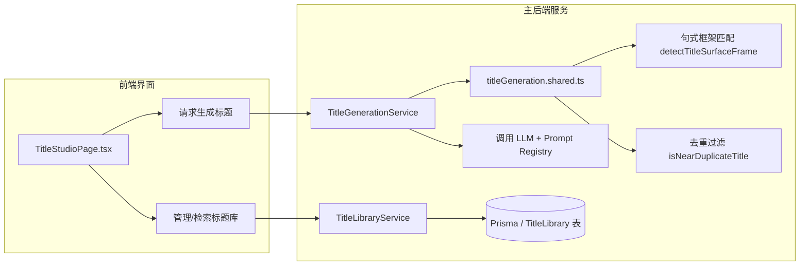

# 标题工坊与标题库设计方案 (V1)

## 1. 背景与目标
网络小说的标题是吸引读者的第一媒介，决定了作品的点击率与吸量能力。在网文创作中，标题通常有特定的吸睛句式与情绪渲染技巧。为了帮助创作者（特别是新手用户）策划出符合市场偏好的爆款标题，系统设计了**标题工坊 (Title Studio)** 与 **标题库 (Title Library)**。

本模块的核心目标是通过大语言模型（LLM）学习网文句式套路，根据创作简报或已有小说大纲，生成具有风格多样性与结构多样性的候选标题，同时建立可供推荐与复用的标题资产库。

## 2. 核心架构与服务划分

标题系统由以下核心组件构成：

### 2.1 标题工坊服务 (TitleGenerationService)
提供三种生成模式：
1. **自由工坊模式 (`brief`)**：用户输入自定义的“创作简报”和期望题材（Genre），系统围绕简报大纲发散生成标题。
2. **参考改写模式 (`adapt`)**：用户提供一个已有的参考标题（如爆款网文名），系统学习其句式结构并结合简报内容进行改写。
3. **书级自动生成模式 (`novel`)**：直连当前小说实体，自动提取小说的题材、简介、大纲和当前标题，作为上下文输入生成专属标题，同时自动排除已有的原标题。

### 2.2 标题库服务 (TitleLibraryService)
负责持久化维护爆款标题、推荐标题资产。支持：
- **按条件筛选**：支持根据关键词搜索（模糊匹配标题、描述、关键词）、题材筛选。
- **多维度排序**：支持“最新发表”、“最热使用 (usedCount)”、“点击率预估 (clickRate)”三种排序规则。
- **引用计数统计**：创作者采纳标题库标题时，调用 `markUsed` 方法，增加其累积使用次数（usedCount）。

## 3. 核心算法与质量保证

为了防止 LLM 产生大量同质化、结构单一、甚至微调字词的重复标题，系统在 [titleGeneration.shared.ts](file:///server/src/services/title/titleGeneration.shared.ts) 中实现了一套质量控制算法：

### 3.1 句式框架自动识别 (Surface Frame Detection)
系统定义了网文中常见的 11 种吸睛句式分类（`TitleSurfaceFrame`），并在生成后利用正则表达式对其进行自动分类：
- `contrast_then_self` (全网嘲笑，我直接...) — 别人与自我对比。
- `setting_then_self` (在末日，我开局...) — 环境设定与自我行动。
- `self_split` (我，百岁老人，觉醒...) — 自我标签分割。
- `colon_split` (怪谈降临：我能...) — 冒号冲突分割。
- `when_open` (当规则降临...) — 状态开启式。
- 以及 `setting_open`, `self_open`, `genre_open`, `comma_split`, `plain_statement` 等。

### 3.2 相似度检测与去重 (Near-Duplicate Filtering)
为了拦截同质化标题，系统使用基于字词 bigram 的 **Jaccard 相似度** 算法：
- 相似度得分计算公式：$J(A, B) = \frac{|A \cap B|}{|A \cup B|}$；
- 如果两个标题的 Jaccard 相似度系数 $\ge 0.78$ 或者是包含关系且字数差 $\le 2$，则判定为“高度相似”，予以过滤，保证生成的标题不重样。

### 3.3 批量质量评分与重试策略 (Batch Quality Scoring & Retry)
在进行 LLM 生成时，单次请求会生成多于目标数量的候选标题。系统会对候选批次（Batch）进行综合质量评分：
$$\text{Score} = (\text{数量} \times 1000) + (\text{风格种类} \times 100) + (\text{句式种类} \times 100) + \text{点击率总和}$$
- 系统至多尝试 3 次重试以生成更优批次；
- 每次生成必须通过 `ensureGenerationQuality` 强校验：候选数量必须达标、且**风格覆盖面**与**句式覆盖面**不能过于集中；
- 若 3 次重试后仍未完全达标，则执行降级退化（Fail-Soft），返回相似度和覆盖率相对最优秀的 best-effort 历史最优批次。

## 4. 数据库模型设计 (TitleLibrary 表)
- `id` (String, 主键): CUID 唯一标识。
- `title` (String): 标题文本（长度限制为 4-40 字符，全局唯一）。
- `description` (String?): 标题的卖点或爽点阐述。
- `clickRate` (Float?): 预估点击率（限制在 0-100%）。
- `keywords` (String?): 关键词，用于多属性匹配。
- `genreId` (String?): 关联的小说类型 ID（软引用）。
- `usedCount` (Int): 累计被小说引用的次数，初始为 0。

## 5. 相关模块
- **前端页面**：[client/src/pages/titles/TitleStudioPage.tsx](file:///client/src/pages/titles/TitleStudioPage.tsx) — 标题工坊与标题库管理后台。
- **生成服务**：[server/src/services/title/TitleGenerationService.ts](file:///server/src/services/title/TitleGenerationService.ts) — LLM 生成、评估与重试逻辑。
- **标题库服务**：[server/src/services/title/TitleLibraryService.ts](file:///server/src/services/title/TitleLibraryService.ts) — 数据库管理与采纳标记。
- **共享工具**：[server/src/services/title/titleGeneration.shared.ts](file:///server/src/services/title/titleGeneration.shared.ts) — Jaccard 过滤、正则句式识别与格式化。
