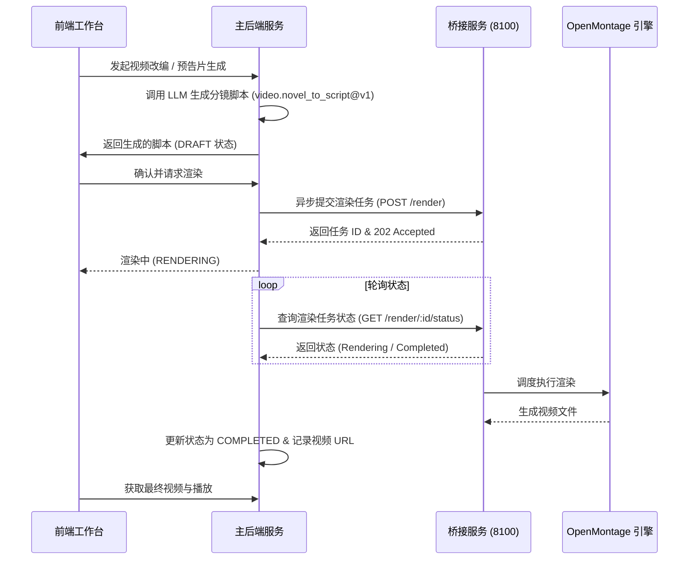

# 视频改编与 OpenMontage 桥接设计方案 (V1)

## 1. 背景与目标
小说创作完成之后，将文字 IP 转化为多媒体（视频、预告片）是提升作品传播度和商业变现的关键路径。为此，本项目设计并实现了视频改编模块，通过对接外部视频渲染工具 OpenMontage，为用户提供从“小说章节”到“分镜脚本生成”再到“视频程序化渲染”的自动化生产线。

## 2. 核心架构设计
系统整体采用轻量耦合的微服务架构：
- **Web API 控制面 (主服务)**：负责接收用户指令、通过 LLM 生成结构化分镜脚本、记录项目状态以及轮询渲染任务。
- **渲染执行面 (OpenMontage Bridge 桥接服务)**：位于 `tools/openmontage-bridge`，使用 FastAPI 框架搭建。负责在独立进程中调用 OpenMontage 命令行或 Python SDK 执行实际的视频渲染与拼装。
- **通信协议**：主服务与桥接服务通过 HTTP REST API 异步通信。

## 3. 数据模型设计
在数据库中设计了 `VideoProject` 模型来记录每个改编项目的全生命周期：
- `id` (String, 主键): CUID 标识符。
- `novelId` (String, 关联小说): 软引用小说实体。
- `chapterId` (String?, 关联章节): 对应生成视频的具体章节。
- `title` (String): 视频/预告片标题。
- `type` (Enum): `ADAPTATION` (章节改编) 或 `TRAILER` (小说预告片)。
- `status` (Enum): `DRAFT` (草稿) / `RENDERING` (渲染中) / `COMPLETED` (已完成) / `FAILED` (失败)。
- `scriptData` (String, JSON): 结构化的场景分镜脚本。
- `videoUrl` (String?): 最终生成的视频文件路径或网络 URL。
- `error` (String?): 失败时的错误日志记录。

## 4. 关键技术细节与约束
1. **统一 Prompt 治理**：
   - 所有的视频脚本生成 Prompt（如 `video.novel_to_script@v1` 和 `video.novel_trailer@v1`）统一注册在 `PromptRegistry` 中。
   - 禁止在业务服务（`VideoScriptService`）中直接拼接内联 System Prompt。
2. **环境隔离与解耦**：
   - 桥接服务使用 `OPENMONTAGE_ROOT` 环境变量动态寻址 OpenMontage 引擎所在的绝对路径，避免在代码中硬编码任何本机用户路径（如 `C:\Users\...`）。
   - 主服务只依赖桥接服务的 HTTP API，无需安装任何 OpenMontage 的 Python 依赖或媒体工具。
3. **分镜脚本结构**：
   - 生成的脚本需符合严格的 Zod Schema 校验，确保每个场景（Scene）包含 `imagePrompt` (画面描述)、`narration` (旁白对白)、`musicMood` (配乐基调) 和 `transition` (转场方式)。

## 5. 相关模块
- **前端页面**：[client/src/pages/video/VideoWorkspacePage.tsx](file:///client/src/pages/video/VideoWorkspacePage.tsx) — 视频改编工作台。
- **主服务客户端**：[server/src/services/video/OpenMontageBridgeClient.ts](file:///server/src/services/video/OpenMontageBridgeClient.ts) — 主后端与桥接服务的通信实现。
- **业务服务**：[server/src/services/video/VideoScriptService.ts](file:///server/src/services/video/VideoScriptService.ts) — 负责调用 LLM 生成分镜。
- **API 路由**：[server/src/modules/video/http/videoRoutes.ts](file:///server/src/modules/video/http/videoRoutes.ts) — 视频改编相关接口。
- **桥接代码**：[tools/openmontage-bridge/server.py](file:///tools/openmontage-bridge/server.py) — 独立微服务入口。
