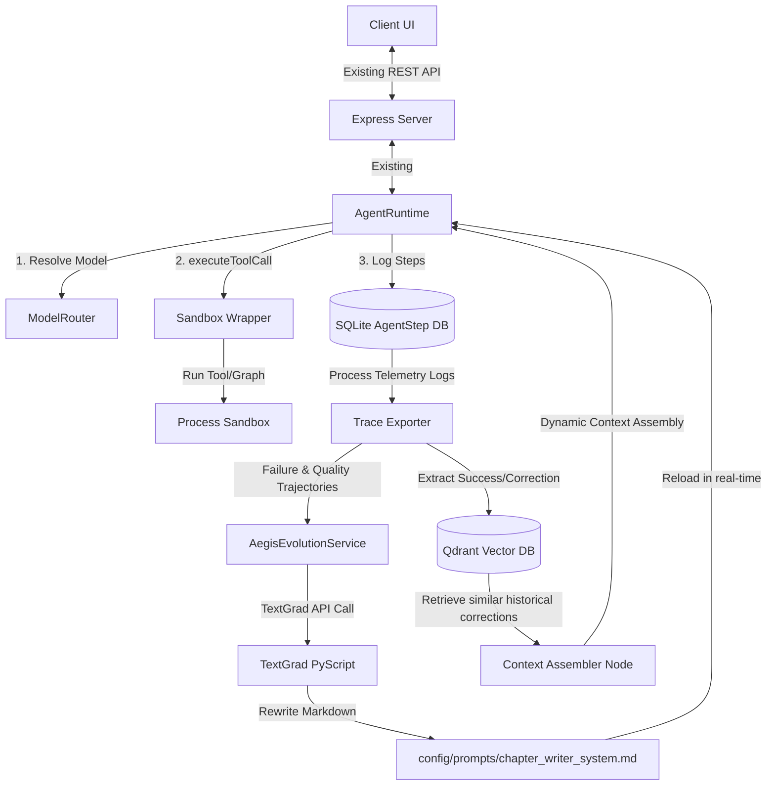
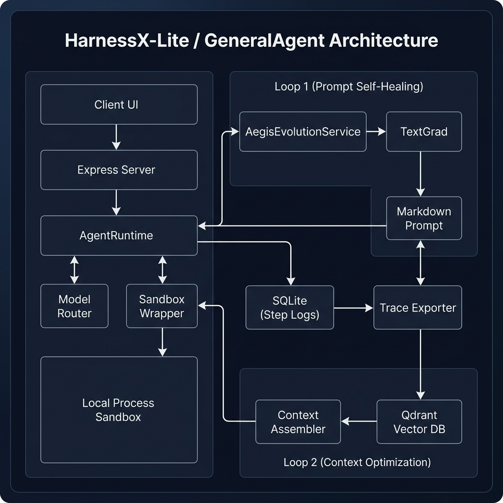

# HarnessX-Lite: MacBook-Optimized Grafting Design for GeneralAgent

This document outlines the core architecture and integration blueprint for retrofitting the **GeneralAgent** novel-writing assistant with the **HarnessX-Lite** framework. It details how to achieve runtime sandboxing, modular graph composition, and dual-loop learning feedback loops (prompt-level self-healing and in-context vector learning) under MacBook hardware constraints.

---

## 1. Core Architecture Blueprint

The integration grafts HarnessX-Lite's telemetry, safety, and learning feedback systems onto GeneralAgent's existing `AgentRuntime` and SQLite DB, preserving all business flows and UI pages.

---

## 2. MacBook-Optimized Feedback Loops

To support continuous learning and improvement without overtaxing a local MacBook GPU, the system deploys a hybrid feedback mechanism focused on optimizing **Prompt Templates** and **Context Window Assembly**:

### Telemetry-Driven Log Collection Purpose
All step execution traces, model inputs/outputs, and user correction logs are captured in SQLite. The explicit purpose of this data collection is to fuel the optimization loops of the runtime configuration (prompts and context loading), since the local environment will not fine-tune model weights directly.

### Loop 1: Prompt-Level Self-Healing via TextGrad (Lightweight & API-Driven)
- **Mechanism**: On any writing failure or quality drop (spotted by `AuditGateNode`), a background service `AegisEvolutionService` extracts the failed steps from SQLite, compiles a `landscape.md` bug report, and runs `textgrad_prompt_optimizer.py`. TextGrad uses LLM API calls (e.g. Claude 3.5 Sonnet) to run textual gradient updates directly on the system prompt template.
- **MacBook Suitability**: Uses almost no local memory/CPU, running in seconds via external APIs.
- **Re-injection**: The evolved system prompt is written back to `config/prompts/chapter_writer_system.md`. The TS prompt loader reads this markdown template on subsequent runs, changing writing behavior instantly.
- **Invocation Timing (调用时机)**:
  - **Trigger Condition (触发条件)**: Triggered asynchronously (non-blocking, running in background worker) whenever a chapter writing run fails the automatic quality audit (`AuditGateNode` validation failure) OR when the user explicitly rejects a generated draft with corrective feedback.
  - **Apply Timing (应用时机)**: Once optimization finishes, the prompt template is overwritten in `config/prompts/` and is instantly loaded for any subsequent chapter generation requests.
- **Data Source & Sufficiency (数据来源与充足度)**:
  - **Data Source**: SQLite `AgentStep` logs (raw prompts and generated texts) + `AuditGateNode` validation errors (syntax/structural/continuity mismatches) + user edit diffs (differences between LLM draft and user's manually polished draft).
  - **Sufficiency Analysis**: Since TextGrad works via instance-based textual gradient descent, even a **single failure trace (N=1)** is mathematically sufficient. The system treats a single failure trajectory as a "failing unit test case" and rewrites the prompt to solve that specific case, preventing regression via a checklist mechanism.

### Loop 2: Dynamic Few-Shot & Context Window Assembly Optimization
- **Mechanism**: Successful writing runs, world bible constraints, and manual user polishes are retrieved and stored as exemplars in the **Qdrant Vector Database** (locally running in Docker/Process).
- **MacBook Suitability**: Extremely fast and requires zero local training compute.
- **Context Assembly Optimization**: The `ContextAssemblerNode` uses the telemetry log data to dynamically tune how the context window is assembled. It manages:
  1. **Dynamic Few-Shot injection**: Queries Qdrant for similar historical chapters or past prompt corrections, and appends them as exemplars.
  2. **Context Window Bounds**: Dynamically prunes character profiles and world-building notes based on chapter relevance to avoid context clutter and prevent model degradation due to long context.
- **Invocation Timing (调用时机)**:
  - **Ingestion Timing (数据写入)**: Runs immediately (asynchronously) when a chapter writing task is marked as `succeeded` or when a user saves a finalized manual polish of a draft.
  - **Retrieval & Assembly Timing (数据读取/装配)**: Runs synchronously at the beginning of each new chapter generation request (inside the `ContextAssemblerNode`), right before the writing LLM is invoked.
- **Data Source & Sufficiency (数据来源与冷启动充足度)**:
  - **Data Source**: Successful chapters (text content stored in Qdrant) + setup stage definitions (Character profiles and World bible notes stored in SQLite) + User-approved drafts.
  - **Sufficiency & Cold Start (冷启动机制)**:
    - *Before Chapter 1 (0-1 Chapters)*: At the start of a novel, no local successful chapters exist. The system handles this data deficiency by using **built-in high-quality seed exemplars** (system-level presets in Qdrant) combined with the user's initial setup details (World settings/Character lists from SQLite). This is sufficient to launch the first chapter.
    - *During Chapter 2+ (1-N Chapters)*: As chapters succeed, local chapters dynamically replace system seeds. The context assembler now retrieves local exemplars, ensuring a personalized continuity loop that grows with the novel.

---

## 3. Implementation Details & Integration Files

### A. Sandbox wrapping in `RunExecutionService.ts`
Wrap high-risk tool execution in `executeToolCall` without altering original tool files:
- Introduce a `sandbox: true` flag in tool definitions.
- If true, execute the tool's action within a restricted `LocalProcessSandbox`, passing context variables as temporary JSON assets and capturing execution logs.

### B. Dynamic LangGraph.js in `ChapterWritingGraph`
Retain the public class interface of `ChapterWritingGraph` but refactor its internal methods to execute a compiled `@langchain/langgraph` workflow loaded from `/config/novel_graph_config.yaml`.
This ensures zero breaking changes to `NovelProductionService` and pipeline runners.

### C. Prompt De-coupling
Move hard-coded prompt text strings out of `.ts` files into markdown configuration assets:
- `config/prompts/chapter_writer_system.md`
- `config/prompts/coherence_optimizer_system.md`
These are read by `chapterWriter.prompts.ts` at runtime using `fs.readFileSync`.

### D. SQLite DB Exporter
- `TraceExporter`: Reads steps for a given `runId` from SQLite database and formats them as standard trajectories JSONL to drive prompt optimization and context assembly tuning.

### E. Modular Construction & Isolated Evaluation Strategy
To ensure system stability, all learning loop components (telemetry exporting, TextGrad prompt tuning, and Qdrant ingestion/retrieval) must be developed and validated **in isolation** before being integrated into the main application:
1. **Isolated Stage 1: Standalone Test Harness**:
   - Write a standalone test script `scratch/test_prompt_optimizer.py` that reads dummy/mock trajectory files (representing failed runs) and executes the TextGrad optimization steps.
   - Use mock inputs to simulate the environment without running the main TypeScript application.
2. **Isolated Stage 2: Effectiveness Evaluation**:
   - Introduce an intentional bug/defect in the prompt (e.g., removing a constraint or adding a conflicting rule).
   - Feed the resulting failed run trajectory into the standalone optimizer.
   - Verify that the optimizer automatically rewrites the prompt to successfully resolve the issue. Measure success by checking if the updated prompt satisfies a validation test.
3. **Application Integration**:
   - Only after Stage 1 and 2 consistently pass and prove the prompt self-healing capability is effective, will the Python scripts be registered in `AegisEvolutionService` and integrated into the TypeScript server's execution pipelines.

---

## 4. Verification Checkpoints & Phases

### Phase 1: Isolated Validation (Standalone Testing)
1. **Trace Export Check**: Run `TraceExporter` stand-alone to verify it queries SQLite correctly and outputs valid JSONL trajectories.
2. **Mock TextGrad Execution**: Execute `python scratch/test_prompt_optimizer.py` with mock failure traces and confirm it outputs corrected system prompt files matching the target schema.
3. **Few-Shot Ingestion Test**: Directly test Qdrant ingestion and retrieval of past chapter drafts using a standalone node script, confirming correct similarity scores.

### Phase 2: Integrated Verification (Application Testing)
1. **Regression Suite**: Run `pnpm test` and `pnpm test:all` to ensure no original novel generation, RAG, or character setup functions are broken by the grafting.
2. **End-to-End Self-Healing Test**: Trigger a writing run with an intentionally broken prompt template, and verify that the system automatically captures the failure, runs TextGrad in the background, rewrites the template, and succeeds on the next run.
3. **Few-Shot Integration Test**: Verify that saving a polished draft writes to Qdrant, and starting the next chapter retrieves and appends this draft as a few-shot exemplar in the user's active writing flow.

---

## 5. Zero-Downtime Development & Safe Migration Strategy (零中断开发与安全迁移策略)

To ensure that the user's active writing session is never interrupted and no data is lost during refactoring, the following dual-workspace isolation and migration plan will be followed:

### A. Environment Isolation (双目录开发隔离)
- **Active Instance (User)**: Running from `/Users/nvidia/GeneralAgent` on Port 3000 (API) / 5173 (Client), using the active database `server/dev.db`.
- **Refactoring Instance (Agent)**: We will copy the source code to a separate development workspace directory, `/Users/nvidia/GeneralAgent/harnessx-refactor` (excluding `.git`, `node_modules`, and `.db` files).
- **Separate Configs**: In `harnessx-refactor/`, we configure the `.env` file to use different ports: Port 3001 (API) / 5174 (Client), and a separate test database `server/dev-test.db`. This prevents any watch-file reloading or process conflicts on the user's running environment.

### B. Database Preservation (数据完全兼容)
- Loop 1 & Loop 2 logic only reads telemetry logs from the existing `AgentStep` table and accesses the vector DB.
- **Zero Schema Changes**: The refactoring requires **no Prisma schema changes, database migrations, or database resets**.
- Consequently, the user's database `server/dev.db` is 100% compatible with the upgraded application code.

### C. Safe Swap & Deployment (平滑切换部署)
1. **Development & E2E Validation**: All development, testing, and E2E validation are performed inside the `harnessx-refactor/` directory.
2. **Source Code Code-Swap**: Once everything passes validation, we copy only the modified source code files from `harnessx-refactor/` back into the main directory `/Users/nvidia/GeneralAgent`.
3. **Fast Reload**: Run `pnpm build` in `/Users/nvidia/GeneralAgent` and quickly restart the background dev server (downtime < 10 seconds).
4. **Resuming Writing**: The user refreshes the browser page at `http://localhost:5173/` and resumes writing immediately with all historical data preserved and Loop 1/2 fully active.

