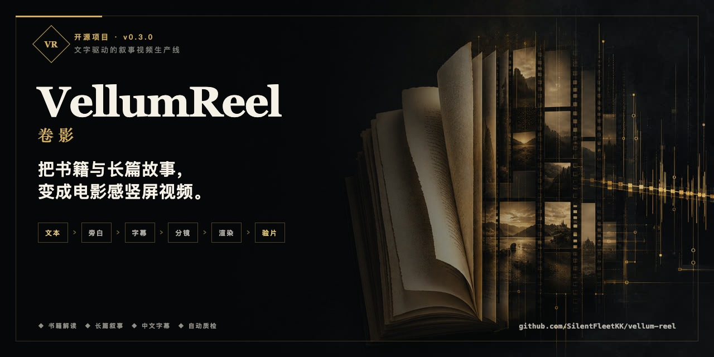
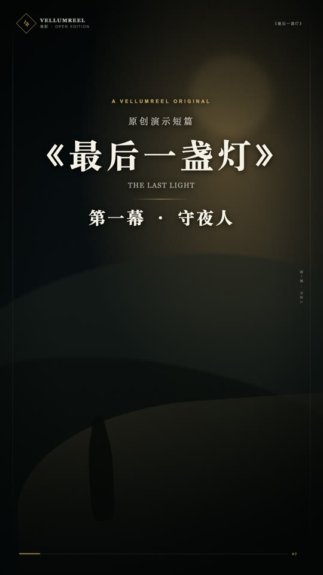
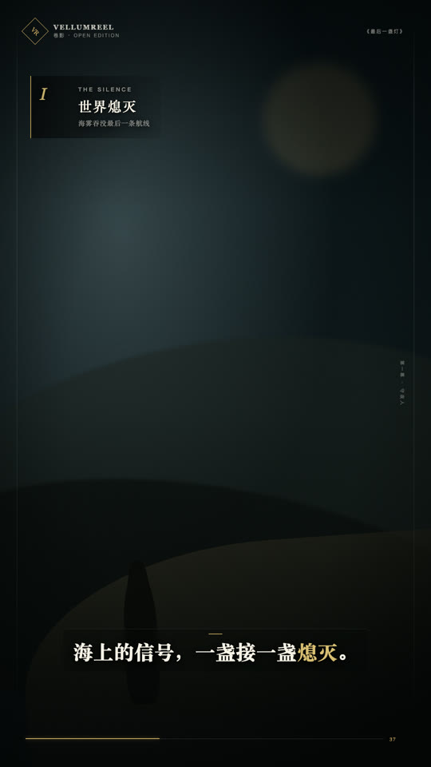
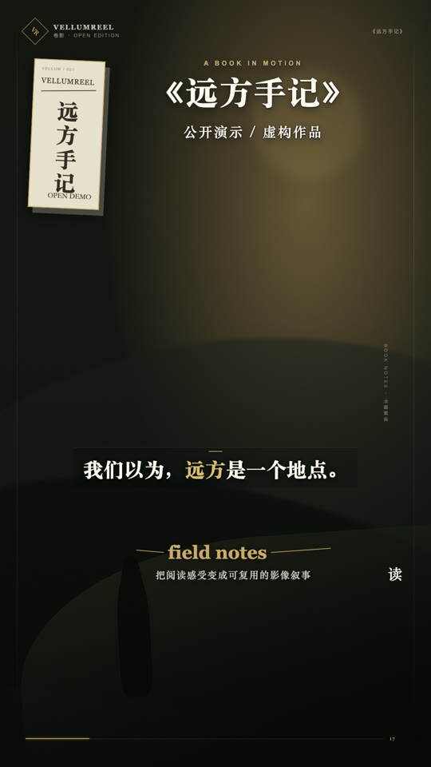

<div align="center">

# VellumReel · 卷影

**Narrative video, shaped by text.**

把书摘、读后感或完整故事，变成可复现、可校验的 9:16 叙事视频。

</div>



<div align="center">
  
  
  
</div>

VellumReel 是一个配置驱动的本地视频生产系统。它不试图成为通用剪辑器，而是解决文字类视频最容易失控的最后一公里：旁白分段、中文字幕、叙事节拍、镜头运动、时长同步、批量渲染和自动验片。

## 为什么是 VellumReel

- **两种叙事模式**：`BookVideo` 用于书籍解读，`NarrativeVideo` 用于小说、播客故事和完整章节。
- **文本优先**：项目、字幕、镜头和章节节拍都是可审阅的 JSON。
- **中文友好**：支持中文语义分屏、停顿合并、关键词强调、对话与引用字幕。
- **声音驱动**：真实旁白时长决定镜头边界，支持分段拼接和 -16 LUFS 响度规整。
- **电影化但克制**：镜头级运动、强度、调色与转场；统一的 VellumReel 品牌框架和阅读进度。
- **生产而非演示**：正式渲染前校验素材、画幅、时间轴；导出后用 FFmpeg/ffprobe 自动验片。
- **内容私有**：仓库默认忽略本地书稿、旁白、图片和成片。

## 快速开始

需要 Node.js 20+、FFmpeg 和 ffprobe。

```bash
npm install
npm run check
npm run studio
```

Studio 默认加载两个无版权风险、无外部素材依赖的原创演示：

- `examples/book-demo`：28 秒书籍解读视觉样例。
- `examples/narrative-demo`：32 秒原创短篇《最后一盏灯》，展示开场、题记、叙事节拍、强调字幕与片尾。

快速渲染：

```bash
npm run demo:book
npm run demo:narrative
```

## 用自己的内容生产

复制一个示例到被 Git 忽略的私有目录：

```bash
cp -R examples/narrative-demo narratives/my-story
```

编辑 `project.json` 和 `captions.json` 后运行：

```bash
npm run render:narrative -- --narrative=narratives/my-story --mode=quick
npm run render:narrative -- --narrative=narratives/my-story --mode=final
```

书籍解读模式：

```bash
cp -R examples/book-demo books/my-book
npm run render:book -- --book=books/my-book --mode=quick
```

媒体文件放在 `public/` 下，JSON 中填写相对于 `public/` 的路径，不要以 `/` 开头。私有生产目录和媒体默认不会进入 Git。

## 叙事模型

每个镜头支持：

- `motion`：`push`、`pull`、`pan-left`、`pan-right`、`drift-up`、`still`
- `intensity`：0–1 的运动强度
- `transition`：`crossfade`、`cut`、`dip`
- `grade`：`neutral`、`amber`、`noir`、`dawn`、`verdigris`
- `focus`：画面焦点，例如 `45% 60%`

长篇叙事还支持 `narrative.beats`。每个节拍在进入时显示章节卡，把长旁白从“连续朗读”升级为有结构的观看体验。

字幕支持三种语气：

```json
{
  "startMs": 29400,
  "endMs": 30900,
  "text": "“我看见你了。”",
  "kind": "dialogue",
  "emphasis": ["看见"]
}
```

## 旁白与字幕

VellumReel 不绑定单一语音供应商。你可以使用自己的录音、合法授权的 TTS 或本地语音模型。

```bash
# 分段旁白拼接、自然留白、响度规整、生成同步表
npm run voice:assemble -- --manifest=narratives/my-story/narration-segments.json --project=narratives/my-story/project.json

# 用最终音频做本地 Whisper 对齐
npm run captions:align

# 已有字幕时导入 SRT
npm run captions:import -- --input=subtitles.srt
```

声音克隆只应用于本人声音或已经获得明确授权的声音。

## 验证与质量控制

```bash
npm run check
npm run produce:preview
npm run produce:final
```

检查包括：

- 9:16 画幅、时间轴连续性和素材存在性
- 字幕重叠、过长与异常留白
- 旁白和视频时长匹配
- H.264 编码、音轨、时长和抽帧联系表
- TypeScript 类型检查与单元测试

## 项目结构

```text
examples/                  可公开的无素材演示
src/video/                 Remotion 画面与叙事组件
src/schema.ts              Zod 项目模型
scripts/                   旁白、字幕、渲染和验片脚本
tests/                     时间轴和字幕测试
public/assets/             本地媒体（默认忽略）
books/                     私有书籍项目（默认忽略）
narratives/                私有长篇项目（默认忽略）
```

## 技术与许可

VellumReel 自有代码采用 [MIT License](LICENSE)。主要依赖包括 Remotion、React、Zod、Whisper.cpp 和 FFmpeg；各依赖仍遵循自己的许可证。

Remotion 使用特殊许可。个人和符合条件的小团队通常可免费使用，较大组织或商业自动化场景应阅读其最新条款并自行取得所需许可：[Remotion License](https://github.com/remotion-dev/remotion/blob/main/LICENSE.md)。本项目的 MIT 许可证不会重新授权 Remotion。

更多说明见 [第三方组件与许可](THIRD_PARTY_NOTICES.md) 和 [素材与权利指南](docs/asset-rights.md)。

## 贡献

欢迎提交问题和改进。请先阅读 [CONTRIBUTING.md](CONTRIBUTING.md)。提交示例时请只使用原创、公共领域或明确允许再分发的素材。
